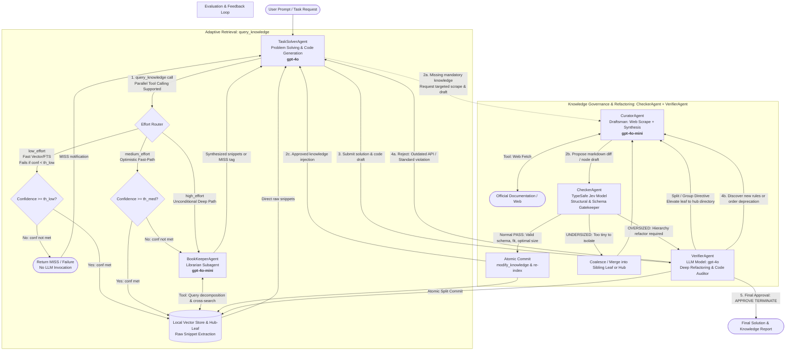

# LibHippo: Permanent Knowledge Library for LLM
## Architecture Proposal & System Specification

> **Project Name**: LibHippo (`libhippo`)  
> **Base Framework**: AutoGen 0.4 (`autogen-agentchat`, `autogen-core`)  
> **Core Architecture**: Cascading Hub-Leaf Knowledge Store, 3-Tier Adaptive Retrieval, Maker-Checker Governance Loop

---

## 1. Problem Definition

### 1.1 Background & Limitations of Existing Agent Architectures
1. **Context Window Bottlenecks and Repeated Retrieval Overhead**:
   - Accumulating raw conversational context over long-horizon tasks leads to prohibitive token costs and the "Lost in the Middle" phenomenon, causing hallucinations or forgetting.
   - Once a session terminates, knowledge evaporates, forcing agents to re-parse massive external documentation or files from scratch in subsequent sessions.
2. **Inefficiencies of Rigid Path Traversal**:
   - When knowledge is stored in strict hierarchical directories (`category/topic/item.md`), requiring agents to guess and provide exact file paths creates repetitive exploratory tool loops and latency spikes.
3. **Knowledge Staleness & Uncontrolled Documentation Decay ("Vibe-Coding" Fallout)**:
   - LLM pre-training data is fixed at a point in time, trailing behind bleeding-edge specifications (e.g., modern framework updates, evolving standards).
   - If agents are permitted to create markdown notes without strict editorial oversight, unvetted, redundant, and conflicting documents rapidly pollute the knowledge base.

### 1.2 Target Goals
- **High-Velocity Semantic Retrieval**: Instant lookup of pre-structured knowledge at the appropriate coarseness level, keeping the active context lean.
- **3-Tier Adaptive Knowledge Dispatch**: Deterministic low-latency retrieval for straightforward lookups alongside autonomous agent-driven triage for ambiguous or complex queries.
- **Living Knowledge Governance**: A closed-loop workflow that continuously validates, deprecates, and compacts knowledge via an isolated Maker-Checker mechanism.

---

## 2. System Architecture & Agent Topologies

The system comprises specialized agents and evaluators coordinated via an AutoGen `GraphFlow`.
Knowledge retrieval is governed by the **`query_knowledge` 3-tier adaptive dispatcher**, while knowledge updates and lifecycle governance are managed via a **tiered Maker-Checker architecture**:
- **Drafting (Maker)**: `CuratorAgent` drafts technical markdown nodes from authoritative web sources.
- **Structural Checking (Checker)**: **`CheckerAgent`** (powered by the **`TypeSafe Jev model`**) provides deterministic, type-safe structural auditing (taxonomy fit, sizing/hysteresis, importance scoring, sibling coalescence, schema validation) without incurring heavy LLM inference overhead.
- **Deep Verifying & Audit (Verifier)**: **`VerifierAgent`** (LLM Model, `gpt-4o`) is summoned when a node is flagged as `OVERSIZED` to plan and execute structural hierarchy refactoring (splitting and grouping into new directory paths), arbitrate deprecations, and audit task solution code.



---

## 3. Agent Specifications, Models, and Context Isolation

To maximize cost efficiency and operational throughput, models and reasoning effort / temperatures are differentiated by role complexity:

| Agent / Model Name | Recommended Model | Reasoning Effort / Temp | Context Isolation Strategy | Core Responsibilities |
| :--- | :--- | :--- | :--- | :--- |
| **`TaskSolverAgent`** | `gpt-4o` | **Medium**<br>(Temp 0.2~0.4) | Main conversational thread (Prompt-cache friendly linear context) | Business logic analysis, code generation, parallel `query_knowledge` execution |
| **`BookKeeperAgent`** | `gpt-4o-mini` | **Minimal**<br>(Temp 0.0) | **Zero-Context Sandbox**<br>(Spun up only on `medium` fallback or `high` effort) | Query decomposition, synonym expansion, multi-leaf cross-referencing, HIT/MISS determination |
| **`CuratorAgent`** | `gpt-4o-mini`<br>(or `gpt-4o` for complex frameworks) | **Low**<br>(Temp 0.1) | Conditional sub-workflow (Active only on `MISS:MANDATORY` or deprecation orders) | Targeted web scraping, synthesis of external facts with LLM reasoning, markdown diff drafting |
| **`CheckerAgent`** | `TypeSafe Jev`<br>(Specialized typed evaluator) | **Deterministic**<br>(Temp 0.0 / Zero LLM token waste) | Stateless Evaluation Sandbox<br>(Inspects candidate node diff, sibling nodes, and parent hub) | **Primary gatekeeper for normal review cases**: Rigid typed structural audit (taxonomy fit, sizing hysteresis, importance scoring, sibling coalescence, SRP coherence, schema validation) |
| **`VerifierAgent`** | `gpt-4o`<br>(or `o3-mini`) | **High / Strict**<br>(Temp 0.0, max effort) | Independent evaluation session (Summoned on escalation or solution draft) | Code specification audit, **escalated hierarchy refactoring (`split/group`) when Checker flags `OVERSIZED`**, sole authority to execute disk commits (`modify_knowledge`), session termination control |

---

### 3.1 `TaskSolverAgent` (Task Executor)
- **Model**: `gpt-4o` (Optimized for coding precision and strict adherence to technical constraints).
- **Hyperparameters**: `temperature: 0.2 ~ 0.4`.
- **Role & Interface**:
  - Analyzes user requirements and issues `query_knowledge(query, effort, criticality)` calls.
  - Supports **Parallel Tool Calling**: When tackling multifaceted tasks, it dispatches multiple discrete queries simultaneously.
  - Generates self-contained, disambiguated queries:
    - Low Effort: `query_knowledge(query="HTML Button syntax", effort="low")`
    - Medium Effort (Default): `query_knowledge(query="HTML custom button ARIA role keyboard accessibility", effort="medium")`
    - High Effort: `query_knowledge(query="HTML button blinks when hovered CSS transform translate-x suspected", effort="high")`
  - Consumes raw snippets returned directly by the fast path or synthesized summaries from `BookKeeperAgent`.
- **Input**: User prompt, retrieved knowledge snippets, `VerifierAgent` feedback.
- **Output**: Implementation code draft, technical summary.

### 3.2 `BookKeeperAgent` (Adaptive Librarian Subagent)
- **Model**: `gpt-4o-mini` (High speed, structured output adherence, 1/15th cost of flagship models).
- **Hyperparameters**: `temperature: 0.0`, Reasoning Effort: None/Minimal.
- **Operational Logic**:
  - **Zero-Context Sandbox**: Operates without conversational history, relying solely on the disambiguated query and librarian system prompt.
  - **Zero Re-summarization**: Because documents are pre-partitioned into Hub (overview) and Leaf (details), the agent extracts and forwards **raw text snippets verbatim**, preventing information degradation and saving tokens.
  - **Query Expansion & Disambiguation**: Decomposes natural language symptoms into technical indices, checks synonyms, evaluates cross-references, and outputs status tags (`[HIT]`, `[MISS:MANDATORY]`, `[MISS:FALLBACK]`).
- **Input**: `query_knowledge(query, effort="medium"|"high", criticality)`.
- **Output**: Target markdown file path, verbatim snippet blocks, hit/miss status tags.

### 3.3 `CuratorAgent` (Knowledge Draftsman)
- **Model**: `gpt-4o-mini` (or `gpt-4o` for intricate cross-stack migrations).
- **Hyperparameters**: `temperature: 0.1`, Reasoning Effort: Low.
- **Role & Permissions**:
  - Triggered exclusively on `MANDATORY` knowledge misses or deprecation instructions from `VerifierAgent`.
  - Employs `search_web` and `fetch_web` to retrieve official documentation and specifications.
  - Blends verified external facts with general programming conventions into standard Hub-Leaf markdown diffs.
  - **Write-Protected**: Lacks disk write capabilities (`modify_knowledge`), submitting drafts solely to `CheckerAgent` / `VerifierAgent`.
- **Input**: Missing topic descriptor, target URLs, verifier change requests.
- **Output**: Proposed markdown diff (addition, amendment, or deprecation).

### 3.4 `CheckerAgent` (Primary Structural & Schema Gatekeeper, Powered by TypeSafe Jev)
- **Model**: `TypeSafe Jev` (Specialized typed evaluation model with strict Pydantic/JSON Schema output contracts).
- **Hyperparameters**: `temperature: 0.0`, Deterministic inference.
- **Normal Review Authority**:
  - Completely handles routine knowledge review and validation without requiring full LLM reasoning overhead:
    1. **Taxonomy & Path Fit**: Verifies whether candidate paths (e.g. `common/web/accessibility.md`) conform to the directory tree and naming conventions.
    2. **Size & Hysteresis Audit**: Evaluates token and section counts against a **hysteresis band** ($[300, 1800]$ tokens). Flags `OVERSIZED` ($> 1,800$ tokens) for splitting and `UNDERSIZED` ($< 300$ tokens) for coalescence, preventing churn.
    3. **Importance Scoring**: Quantifies document centrality ($0.0 \sim 1.0$) based on generality, security criticality, and architectural permanence.
    4. **Sibling Coalescence**: Determines whether an undersized document should be merged into existing sibling nodes at the same level (e.g., merging `input.md` into `button.md, label.md, checkbox.md` or a collective `form_controls.md`).
    5. **Coherence & SRP**: Ensures Single Responsibility Principle and strict separation between `Summary (Coarse)` and `Detailed Rules (Fine)`.
    6. **Frontmatter Schema Validation**: Guarantees typed metadata validity.
- **Output Verdict**:
  - `PASS`: Allows atomic commit via `modify_knowledge` directly.
  - `MERGE_REQUIRED`: Rejects isolated file creation and orders consolidation into siblings or parent hub.
  - `ESCALATE_REFACTOR`: Escalates to `VerifierAgent (LLM)` when an oversized node necessitates structural directory splitting.

### 3.5 `VerifierAgent` (Quality Auditor, Deep Refactorer & Gatekeeper)
- **Model**: `gpt-4o` (or `o3-mini` with strict reasoning effort).
- **Hyperparameters**: `temperature: 0.0`, Reasoning Effort: High / Strict.
- **Escalated Hierarchy Refactoring & Gatekeeping**:
  - **Structural Split / Group Refactoring**: When `CheckerAgent` flags a document as `OVERSIZED` (or structurally incoherent), `VerifierAgent` analyzes topic boundaries and formulates the refactoring plan:
    - Promotes a leaf document to a Hub document (`web.md` $\rightarrow$ Hub `web.md` + directory `web/`).
    - Groups subtopics into modular child leaves (`web/a.md`, `web/b.md`, ...).
    - Instructs `CuratorAgent` or applies the split atomically via `modify_knowledge`.
  - **Solution Audit**: Scrutinizes code from `TaskSolverAgent` for deprecated APIs, security antipatterns, and style violations.
  - **Exclusive Disk Commit Authority**: Sole agent equipped with `modify_knowledge` to atomically write markdown changes and update vector indices.
  - **Session Termination**: Emits `[APPROVE: TERMINATE]` once all quality gates pass.
- **Input**: Code draft from TaskSolver, markdown proposals/escalated reports from Checker/Curator.
- **Output**: Approval termination tag, actionable revision feedback (`REVISE`), or disk mutation executions.

---

## 4. Cascading Knowledge Scopes & Storage Design

The knowledge repository is organized into hierarchical, scoped namespaces where granular rules override broader defaults:
$$\text{Project (Highest)} > \text{User (Preferences)} > \text{Plugins (Optional Packs)} > \text{Common (General Standards)}$$

### 4.1 Hub-and-Leaf Directory Structure
Every directory pairs with a sibling markdown file of identical basename. The parent file functions as a **Hub Document (coarse overview and child index)**, while internal files act as **Leaf Documents (fine-grained rules, edge cases, and code patterns)**.

```text
libhippo/knowledge/
├── knowledge_catalog.db              <-- Local SQLite FTS5 / metadata catalog index
├── common.md                         <-- Level 0 (Root Hub): General domain standard overview
├── common/
│   ├── web.md                        <-- Level 1 (Domain Hub): Web technology standards
│   └── web/
│       ├── html.md                   <-- Level 2 (Category Hub): HTML5 rules & semantic structure
│       └── html/
│           ├── syntax.md             <-- Level 3 (Leaf): Concrete syntax & tags
│           └── accessibility.md      <-- Level 3 (Leaf): ARIA & keyboard navigation edge cases
├── user.md                           <-- User Root Hub
├── user/
│   └── preferences.md                <-- User coding styles & preferred packages
├── project.md                        <-- Project Root Hub (Tracked in Git)
├── project/
│   └── architecture.md               <-- Repository architecture & schema rules
├── plugins/                          <-- Modular plug-and-play knowledge bundles
│   └── react19.md / react19/
└── deprecated/                       <-- Quarantined, superseded knowledge records
```

### 4.2 Local Vector Store Indexing & Atomic Synchronization
- **Source of Truth**: Local human-readable, Git-tracked **Markdown files (`.md`)**.
- **Index Accelerator**: Local **Vector Store (ChromaDB or SQLite-vec)** storing chunk embeddings and metadata for fast similarity lookup.
- **Instant Synchronization**: When `VerifyAgent` writes a modification or archives a document into `deprecated/`, active entries are immediately re-indexed, preserving 100% search freshness without fine-tuning model weights.

### 4.3 Markdown Node Schema Example (`common/web/html/accessibility/aria_button.md`)
```markdown
---
title: "Button Accessibility with ARIA"
namespace: "common" # common | user | project | plugins
level: "leaf"
coarseness: 3
version: "WAI-ARIA 1.2"
status: "active" # active | deprecated | needs_review
last_updated: "2026-09-28"
related:
  - "common/web/html/syntax/semantic_tags.md"
tags: ["html", "a11y", "aria", "button"]
access_count: 0
last_accessed: "2026-09-28"
nature: "critical_rule" # foundation | critical_rule | transient_tip
importance: 0.85 # 0.0 ~ 1.0 (Scored by CheckerAgent/Jev, provides subtle retrieval boost in query_knowledge)
---

## Summary (Coarse View)
Use native `<button>` whenever possible. Only use `role="button"` on `<div>` with `tabindex="0"` and keyboard listeners (Enter/Space).

## Detailed Rules & Edge Cases (Fine View)
- Ensure preventDefault() on Space key to avoid page scroll.
- Add aria-pressed for toggle buttons.
```

### 4.4 Prompt-Cache Friendly Linear Context & Lazy Compaction
To leverage modern LLM prefix caching (e.g., OpenAI Prompt Caching) without incurring cache invalidation from sliding windows or head-summary-tail rewrites:

```text
[Prompt-Cache Maximized 3-Zone Architecture]
┌────────────────────────────────────────────────────────────────────────┐
│ Zone 1: Immutable Prefix (Guaranteed 100% Cache Read)                  │
│  - System Instructions + User/Project Profile summaries + Catalog spec │
│  👉 Unchanged across the entire session -> 50~80% cost & latency drops │
├────────────────────────────────────────────────────────────────────────┤
│ Zone 2: Append-Only Linear History (KV-Cache Extension Zone)           │
│  - User prompt + Agent reasoning trace (CoT)                           │
│  - query_knowledge tool calls & returned raw markdown snippets         │
│  👉 Sequential addition preserves previous turn KV-cache entirely      │
├────────────────────────────────────────────────────────────────────────┤
│ Zone 3: Lazy Compaction (Triggered only when exceeding token quota)    │
│  - Trigger: Cumulative tokens exceed threshold (e.g., 8,000 tokens)    │
│  - Action: Retains reasoning traces, but evicts bulky past tool outputs│
│    (replaces raw snippets with '[Referenced: common/.../syntax.md]')   │
└────────────────────────────────────────────────────────────────────────┘
```

### 4.5 Dynamic Hierarchy Lifecycle: Split & Merge Mechanics

The knowledge store is not static; it dynamically adapts to content growth and fragmentation through strict structural refactoring rules enforced by `CheckerAgent` and `VerifierAgent`:

```text
[Knowledge Growth & Splitting: Size >= 1,800 tokens]
web.md (Leaf: >1,800 tokens) 
       │
       ▼ (CheckerAgent flags OVERSIZED -> VerifierAgent refactors)
├── web.md (Elevated to Hub: High-level overview, architecture & TOC)
└── web/   (New directory created)
    ├── a.md (Extracted child leaf: Topic A)
    └── b.md (Extracted child leaf: Topic B)

[Knowledge Fragmentation & Merging: Size <= 300 tokens]
button.md, label.md, checkbox.md + [Candidate: input.md (<300 tokens)]
       │
       ▼ (CheckerAgent flags UNDERSIZED / Sibling Coalescence)
form_controls.md (Merged composite leaf) OR appended to parent hub rules

[Hysteresis Stability Zone / Deadband: 300 ~ 1,800 tokens]
No split or merge allowed. Node remains completely stable against thrashing.
```

#### 4.5.1 Split Dynamics & Hysteresis Upper Bound
When a leaf node accumulates substantial technical depth, keeping all rules in a single file introduces retrieval noise and dilutes vector chunk relevancy.
1. **Trigger Condition (Hysteresis Upper Bound $\theta_{\text{split}}$)**:
   - Content length exceeds $\theta_{\text{split}} \ge 1,800 \sim 2,000$ tokens (or contains $\ge 4$ distinct subtopic headers).
   - Topical cohesion drops below threshold (mixing disparate concerns, e.g. basic syntax, complex accessibility, and performance tuning).
2. **Refactoring Workflow**:
   - `CheckerAgent` emits `ESCALATE_REFACTOR`.
   - `VerifierAgent` (LLM) is summoned with: *"Determine if this should be refactored; if so, generate the split/group plan."*
   - VerifierAgent designs the decomposition plan:
     1. **Path Elevation**: The original `path/web.md` is promoted to a **Hub document** containing the coarse overview, architectural principles, and links to children.
     2. **Directory Elevation**: Sibling directory `path/web/` is created.
     3. **Modular Partitioning**: Subtopics are factored into discrete child leaves (`path/web/a.md`, `path/web/b.md`, ...), each with calibrated frontmatter.
     4. **Atomic Commit & Re-index**: `VerifierAgent` executes `modify_knowledge` to atomically commit files and update the FTS5 catalog and vector embeddings.

#### 4.5.2 Merge Dynamics & Hysteresis Lower Bound
Conversely, creating tiny, isolated files for single-line tips or minor element variants causes "directory bloat" and excessive exploratory tool loops.
1. **Trigger Condition (Hysteresis Lower Bound $\theta_{\text{merge}}$)**:
   - Content length falls below $\theta_{\text{merge}} \le 200 \sim 300$ tokens (or contains only a single isolated rule).
   - High taxonomic overlap with existing sibling nodes at the same directory level (e.g. `button.md`, `label.md`, `checkbox.md`, alongside a candidate `input.md`).
2. **Coalescence Resolution**:
   - `CheckerAgent` rejects solitary file creation (`verdict: MERGE_REQUIRED`).
   - Recommends one of two coalescence strategies:
     - **Sibling Coalescence**: Merge related micro-leaves into a unified, cohesive composite leaf (e.g. consolidating `button.md`, `label.md`, `checkbox.md`, `input.md` into `form_controls.md`).
     - **Hub Absorption**: Append the single-rule edge case directly into the parent Hub's `Detailed Rules & Edge Cases` section.

#### 4.5.3 Composite Sizing: Local Token Counting + Jev Semantic Bloatiness
Counting tokens is an exact deterministic arithmetic operation that local code performs in $<1$ms (e.g. via `tiktoken`). In contrast, evaluating conceptual bloat, discursive verbosity, and architectural over-packing is a semantic judgment where **TypeSafe Jev** shines.

LibHippo uses **Composite Sizing** combining deterministic code measurement with Jev's semantic score:
1. **Deterministic Local Code**:
   - Calculates exact `raw_token_count` and section/heading metrics.
2. **Jev Semantic Bloatiness Judgment (`bloatiness` Score)**:
   - Measures semantic density versus discursive fluff and topic stuffing on an ordered spectrum:
     - Level 0: *Under-developed / Sparse stub* (superficial rules, insufficient depth for a standalone node).
     - Level 1: *Lean & Optimal Density* (crisp, high-signal rules and concise edge cases).
     - Level 2: *Discursive Bloat* (rambling explanations, wordy prose, minor scope creep).
     - Level 3: *Severe Bloat / Monolithic Overload* (stuffing multiple orthogonal sub-domains into one document).
3. **Composite Effective Size Formula**:
   $$\text{EffectiveSize} = \text{RawTokenCount} \cdot \left(0.75 + 0.35 \cdot \text{Score}_{\text{bloatiness}}\right)$$
   - *Example A (Oversize Split)*: A 1,400-token document with severe monolithic bloat (Level 3) yields $\text{EffectiveSize} = 1,400 \cdot 1.80 = 2,520 > \theta_{\text{split}} (1,800)$, successfully triggering an architectural split before reaching extreme token counts.
   - *Example B (Dense Technical Reference)*: A 1,700-token document with compact reference tables and high density (Level 1) yields $\text{EffectiveSize} = 1,700 \cdot 1.10 = 1,870$, remaining near the stability margin without premature disruption.
   - *Example C (Under-sized Merge)*: A 350-token document containing mostly superficial fluff (Level 0) yields $\text{EffectiveSize} = 350 \cdot 0.75 = 262.5 < \theta_{\text{merge}} (300)$, directing sibling coalescence.

- **Stability Deadband ($[300, 1800]$ effective tokens)**: Documents in this neutral composite range are strictly immune to automatic split or merge actions.

#### 4.5.4 CheckerAgent Evaluation Contract (TypeSafe Jev)
`CheckerAgent` evaluates every proposed knowledge modification across typed semantic dimensions:

```python
class JevAuditReport(BaseModel):
    # 1. Taxonomic fit: Does the path and filename fit the hierarchy semantics?
    taxonomy_fit: Literal["optimal", "misplaced", "rename_suggested"]
    suggested_path: str | None = None
    
    # 2. Local Deterministic + Jev Semantic Sizing
    raw_token_count: int  # Measured deterministically in local Python code
    bloatiness_score: float  # 0.0 ~ 3.0 (Jev Score: under-developed -> lean -> bloated -> monolithic)
    effective_token_size: float  # Calculated composite metric
    size_status: Literal["optimal", "oversized", "undersized", "in_deadband"]
    
    # 3. Importance Scoring: Generality, security criticality, architectural weight
    importance_score: float = Field(ge=0.0, le=1.0)
    
    # 4. Sibling Coalescence: Can tiny nodes be merged with same-level siblings?
    merge_candidate_siblings: list[str] = []
    merge_recommendation: Literal["none", "merge_into_sibling", "fold_into_parent_hub"] = "none"
    
    # 5. Coherence & Single Responsibility Principle (SRP)
    coherence_score: float  # 0.0 ~ 1.0 (Strict separation of Coarse Summary vs Fine Rules)
    topic_drift_detected: bool
    
    # 6. Redundancy & Conflict Detection
    redundancy_status: Literal["novel", "partial_overlap", "duplicate_conflict"]
    conflicting_paths: list[str] = []
    
    # 7. Frontmatter Schema Compliance
    schema_valid: bool
    schema_errors: list[str] = []
    
    # Overall Actionable Gate Verdict
    verdict: Literal["PASS", "REVISE_SCHEMA", "MERGE_REQUIRED", "ESCALATE_REFACTOR"]
```

#### 4.5.5 Importance-Aware Retrieval Scoring in `query_knowledge`
Documents evaluated by `CheckerAgent` are assigned an `importance_score` ($0.0 \sim 1.0$), recorded in the frontmatter (`importance: 0.85`) and indexed in `knowledge_catalog.db`.
- **Retrieval Scoring Formula**:
  $$\text{Confidence} = (1 - \alpha) \cdot \text{Sim}_{\text{cosine}} + \alpha \cdot \text{Score}_{\text{importance}} \quad (\alpha = 0.08)$$
- **Design Intent**:
  - Relevance ($\text{Sim}_{\text{cosine}}$) remains the dominant factor; high importance never retrieves irrelevant content.
  - However, when candidate documents have comparable semantic similarity, foundational standards and critical security rules reliably win tie-breakers over obscure edge cases.
  - Borderline relevant high-importance documents more readily clear retrieval confidence gates ($\tau_{\text{low}} = 0.70$ and $\tau_{\text{med}} = 0.82$), reducing unwarranted misses on vital architectural knowledge.

#### 4.5.6 Decoupled Review: CheckerAgent on Routine Reviews
- **Normal Review Optimization**: Routine document additions or incremental updates that pass CheckerAgent's audit (`verdict: PASS`) bypass LLM reasoning completely. They are committed directly to disk via `modify_knowledge`, slashing review latency to $< 100$ms and incurring $0 LLM token cost.
- **LLM Escalation Exclusivity**: `VerifierAgent` (LLM) is reserved strictly for high-order architectural decisions:
  1. Splitting and reorganizing `OVERSIZED` hierarchy branches.
  2. Resolving complex semantic deprecation conflicts.
  3. Auditing `TaskSolverAgent` code solutions against specifications.

### 4.6 3-Tier Query Criticality
To avoid unnecessary web lookups when information is missing:
1. **`MANDATORY`**: Strict security rules or framework version constraints $\rightarrow$ On miss, triggers `CuratorAgent` to fetch official external docs.
2. **`PREFERRED`** (Default): Common idioms and conventions $\rightarrow$ On miss, falls back to `TaskSolverAgent`'s internal knowledge (0 web search overhead).
3. **`OPTIONAL`**: Auxiliary helpers or nice-to-haves $\rightarrow$ On miss, skipped immediately.

---

## 5. Core Tool Specifications

### 5.1 `query_knowledge` (Adaptive Knowledge Retrieval Tool)

```python
async def query_knowledge(
    query: str,
    effort: Literal["low", "medium", "high"] = "medium",
    criticality: Literal["mandatory", "preferred", "optional"] = "preferred",
    threshold_low: float = 0.70,
    threshold_medium: float = 0.82,
) -> KnowledgeRetrievalResult:
    """
    Queries the LibHippo knowledge base using a 3-tier effort strategy:
    
    Confidence Scoring Formula:
      confidence = (1 - 0.08) * cosine_sim + 0.08 * doc_importance
      (Relevance is dominant; importance provides subtle tie-breaker and threshold boost).
    
    1. effort="low":
       - Executes local Vector / FTS search (<50ms, 0 LLM cost).
       - Evaluates if top match confidence >= threshold_low.
       - If met: Returns matching raw document snippets directly.
       - If NOT met: Fails immediately (returns [MISS:FALLBACK], no LLM fallback).
       
    2. effort="medium" (Default):
       - Executes local Vector / FTS search first.
       - Evaluates if top match confidence >= threshold_medium.
       - If met: Returns raw snippets directly (<50ms, 0 LLM cost).
       - If NOT met: Automatically escalates to BookKeeperAgent (gpt-4o-mini).
         The librarian performs query expansion, multi-leaf cross-search,
         and marks the query as [HIT], [MISS:MANDATORY], or [MISS:FALLBACK].
         
    3. effort="high":
       - Bypasses single-vector matching.
       - Directly invokes BookKeeperAgent for multi-hop synthesis,
         cross-domain bug investigations, and query decomposition.
    """
```

### 5.2 Tool Registry Overview

| Tool Name | Caller | Input Arguments | Functional Description |
| :--- | :--- | :--- | :--- |
| **`query_knowledge`** | `TaskSolverAgent` | `query: str`, `effort: "low"\|"medium"\|"high"`, `criticality: "mandatory"\|"preferred"\|"optional"`, `threshold_low: float`, `threshold_medium: float` | Dispatches query across the 3 effort tiers using importance-aware confidence scoring, returning raw snippets or librarian synthesis. |
| **`search_knowledge`** | `BookKeeperAgent` | `query: str`, `top_k: int = 3`, `namespace: str = None` | Searches the local Vector Store (ChromaDB/SQLite-vec) by cosine similarity, returning node metadata, importance, and file paths. |
| **`read_knowledge`** | `BookKeeperAgent` | `file_path: str`, `section: "summary"\|"rules"\|"full"` | Reads the specified section from a Hub or Leaf markdown document without lossy re-summarization. |
| **`audit_knowledge`** | `CheckerAgent`<br>*(TypeSafe Jev)* | `path: str`, `content: str`, `parent_hub_path: str`, `sibling_paths: list[str]` | Executes 7-dimension typed structural audit (taxonomy fit, sizing hysteresis, importance scoring, SRP coherence, sibling coalescence, YAML schema), returning `JevAuditReport`. |
| **`fetch_web`**, **`search_web`** | `CuratorAgent` | `search_query: str`, `doc_url: str = None` | Conducts targeted searches against official documentation domains and scrapes technical specifications. |
| **`modify_knowledge`** | `VerifierAgent`<br>*(Sole Authority, auto-approved on Checker PASS)* | `action: "create"\|"update"\|"split"\|"merge"\|"purge"`, `path: str`, `content: str`, `metadata: dict`, `extra_paths: list[str] = None` | Atomically commits markdown changes, directory creations, or split/merge refactoring to the local filesystem and synchronizes the vector index. |

---

## 6. Termination Conditions

1. **Normal Termination**:
   - `VerifierAgent` completes its inspection of the solution code and any associated knowledge updates.
   - Emits `[APPROVE: TERMINATE]` in its final response, fulfilling the `TextMentionTermination` criterion.
2. **Safety Guardrail Termination**:
   - `MaxMessageTermination(max_messages=16)`: Prevents infinite discussion loops by terminating execution after 16 conversational rounds, outputting current artifacts and unresolved blockers.
   - Per-path tool invocation retry limit: Maximum 2 consecutive retry attempts on identical knowledge paths.

---

## 7. Failure Recovery Workflows

| Failure Mode | Root Cause | System Recovery Workflow |
| :--- | :--- | :--- |
| **1. Stale Knowledge Collision** | The repository contains an outdated specification, while the user expects modern APIs (e.g., React 19). | `VerifierAgent` flags obsolete syntax $\rightarrow$ `CuratorAgent` marks old document as `deprecated/` and drafts modern replacement $\rightarrow$ `VerifierAgent` commits to disk $\rightarrow$ `TaskSolverAgent` regenerates code. |
| **2. Low-Effort Retrieval Miss** | `effort="low"` query failed because match confidence was below `threshold_low`. | Fast failure returned to `TaskSolverAgent` $\rightarrow$ Solver can either proceed using baseline LLM common sense or escalate to `effort="medium"`/`"high"`. |
| **3. Catalog Miss on Mandatory Topic** | `BookKeeperAgent` cannot find documentation required by a `MANDATORY` constraint. | BookKeeper emits `[MISS:MANDATORY]` $\rightarrow$ `CuratorAgent` executes targeted web scrape $\rightarrow$ `VerifierAgent` reviews and commits new leaf $\rightarrow$ Fresh snippet injected into Solver context. |
| **4. Documentation Bloat ("Vibe-Coding" Clutter)** | Repetitive markdown notes created for minor edge cases. | `CheckerAgent` rejects solitary file creation (`MERGE_REQUIRED`), directing `CuratorAgent` to append a compact 1-line rule into an existing Leaf document's `Detailed Rules` section or parent Hub. |
| **5. Oversized Knowledge Node (Hierarchy Bloat)** | Leaf document accumulates excessive depth exceeding hysteresis upper bound ($>1,800$ tokens) with divergent subtopics. | `CheckerAgent` flags `OVERSIZED` and triggers `ESCALATE_REFACTOR` $\rightarrow$ `VerifierAgent` evaluates refactoring plan $\rightarrow$ Elevates `web.md` to Hub document, creates directory `web/`, and partitions content into `web/a.md`, `web/b.md`, ... $\rightarrow$ Atomically committed and re-indexed. |
| **6. Fragmented Micro-Document Sprawl** | Tiny, isolated single-rule documents proposed below hysteresis lower bound ($<300$ tokens) alongside siblings. | `CheckerAgent` flags `UNDERSIZED` with sibling coalescence directive $\rightarrow$ Groups and merges related components into a unified composite leaf (`form_controls.md`) or folds into parent Hub. |
