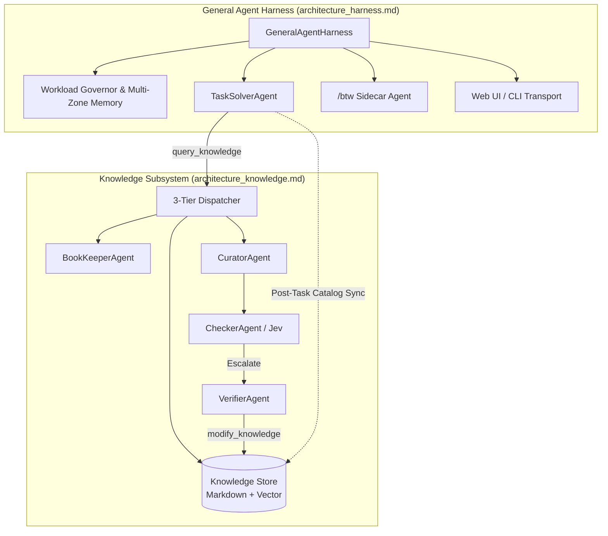

# LibHippo Architecture

LibHippo is an autonomous coding agent framework built on AutoGen 0.4. It decouples into two core pillars:

1. **[Knowledge Management Subsystem](architecture_knowledge.md)** (`libhippo.storage`, `libhippo.tools`, `libhippo.agents`): General-purpose, permanent knowledge library for LLM.
2. **[General Agent Harness](architecture_harness.md)** (`libhippo.runner`, `libhippo.web`): Multi-zone memory, tool execution runtime, targeted WebSockets with delta chaining, and interactive web interface.

For design rationale, trade-offs, and benchmarks, refer to [design_rationale_and_qa.md](design_rationale_and_qa.md).

---

## 1. Knowledge Management Subsystem

Maintains living, audited engineering knowledge across agent sessions.

- **Storage (`libhippo.storage`)**:
  - Cascading tree namespaces: `project/` (repository rules), `common/` (shared idioms), `user/` (preferences), `plugins/` (external tools).
  - Markdown files serve as the human-auditable source of truth.
  - Local vector store (SQLite-vec / ChromaDB) accelerates coarse/fine semantic queries.
  - Hub (summaries) and Leaf (detailed rules) layout eliminates runtime summarization costs.
- **3-Tier Adaptive Retrieval (`query_knowledge`)**:
  - `effort=low`: Vector/FTS search ($\tau \ge 0.70$). Returns immediately on miss without LLM calls.
  - `effort=medium`: Vector search ($\tau \ge 0.82$), escalates to stateless `BookKeeperAgent` lookup on miss.
  - `effort=high`: Broad vector seed + deep `BookKeeperAgent` exploration. Falls back to web research if criticality is mandatory.
  - `criticality`: `mandatory` (obligatory curation on miss), `preferred` (fallback to model weights, 0 web calls), `optional` (fail fast).

- **Agents Orchestration**: `GraphFlow`
  - `TaskSolverAgent` is related to general agent harness.
  - `BookKeeperAgent` Performs advanced search if fast-path `query_knowledge` fails.
  - **Maker-Checker Governance Loop (`libhippo.orchestration.maker_checker`)**

    1. `CuratorAgent` as maker generates candidate markdown drafts from web and conversation context. Complete draft is handed to `CheckerAgent`.
    2. `CheckerAgent` (TypeSafe Jev) as checker evaluates frontmatter, length bounds with hysteresis, content quality, and rule effectiveness and invokes `CuratorAgent` (for low quality) or  `VerifierAgent` (for merge/split) if needed.
    3. `VerifierAgent` as verifier handles escalations (splitting oversized nodes, merging undersized stubs) and holds exclusive disk write authority (`modify_knowledge`).

---

## 2. General Agent Harness

Provides an execution runtime for autonomous software engineering tasks.

- **Multi-Zone Memory & Workload Governance (`libhippo.runner.memory`, `governor`)**:
  - **Zone 1 (Static Prefix)**: System prompt, security policies, and tool definitions (100% KV-cache warm).
  - **Zone 2 (Linear History)**: Conversation turns tagged with temporal metadata (`<USER_PROMPT timestamp=...>`).
  - **Zone 3 (Compacted Tool Outputs)**: Evictable execution logs deterministically compacted to reference pointers near context limits.

- **Tool Suite (`libhippo.runner.tools`)**:
  - **Filesystem**: `read_file` (windowed, max 800 lines), `write_file` (targeted line/string replace), `overwrite_file`, `delete_file`.
  - **Code Exploration**: Pure Python `search_file` (hierarchical `.gitignore` parsing) and `list_dir`.
  - **Terminal & Tasks**: Sandboxed `run_command` and background `manage_task` execution.
  - **Subagents**: `invoke_subagent` and `manage_subagents` for isolated or inheriting parallel tasks.
  - **User Interaction**: Interactive `ask_question` modal and ambient `get_status`.

- **Targeted Transport Architecture (`libhippo.runner.transport`)**:
  - **Dedicated WebSockets**: Uses `previous_response_id` for delta chaining and native mid-turn steering.
  - **Resilient HTTP Fallback**: Automatic failover to `OpenAIResponsesClient` on socket drop.
  - **Ephemeral Sidecar (`/btw`)**: Parallel, non-interfering queries hitting warm parent KV-cache.

- **Client Decoupling**:
  - Headless backend engine (`GeneralAgentHarness`) streaming typed events (`TokenChunkEvent`, `ToolCallStartEvent`, `ToolCallResultEvent`, etc.).
  - React 19 web frontend (`frontend/web`) and aiohttp server (`src/libhippo/web`).

---

## 3. Subsystem Architecture

---

## Documents

- [Knowledge Architecture (`architecture_knowledge.md`)](architecture_knowledge.md): Knowledge tree schema, 3-tier retrieval, and Maker-Checker contracts.
- [Harness Architecture (`architecture_harness.md`)](architecture_harness.md): Agent harness, multi-zone memory, tools, and network transport.
- [Design Rationale & Q&A Log (`design_rationale_and_qa.md`)](design_rationale_and_qa.md): Trade-offs, design dilemmas, derivations, and benchmarks.
