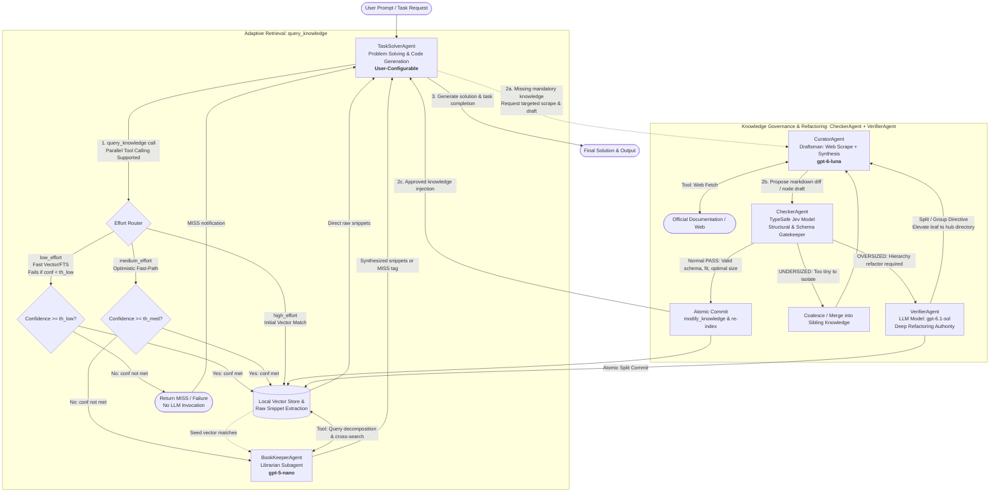

# LibHippo: Permanent Knowledge Library for LLM
## Architecture Proposal & System Specification

> **Project Name**: LibHippo (`libhippo`)  
> **Base Framework**: AutoGen 0.4 (`autogen-agentchat`, `autogen-core`)  
> **Core Architecture**: Cascading Tree Knowledge Store, 3-Tier Adaptive Retrieval, Maker-Checker Governance Loop

---

## 1. Problem Definition

### 1.1 Background & Limitations of Existing Agent Architectures
1. **Context Window Bottlenecks and Repeated Retrieval Overhead**:
   - Accumulating raw conversational context over long horizons causes prohibitive token costs and "Lost in the Middle" hallucinations.
   - Knowledge evaporates when sessions terminate, forcing agents to repeatedly parse massive external documentation in subsequent sessions.
2. **Inefficiencies of Rigid Path Traversal**:
   - Requiring agents to guess hierarchical file paths (`category/topic/item.md`) leads to repetitive exploratory tool loops and latency spikes.
3. **Knowledge Staleness & Uncontrolled Sprawl**:
   - Fixed LLM pre-training data trails behind evolving framework specifications and standards.
   - Unvetted markdown note creation rapidly pollutes the knowledge base with redundant and conflicting documents.

### 1.2 Target Goals
- **High-Velocity Semantic Retrieval**: Coarse-to-fine pre-structured knowledge lookups that keep the active context lean.
- **3-Tier Adaptive Knowledge Dispatch**: Deterministic low-latency retrieval for direct lookups alongside autonomous agent triage for ambiguous queries.
- **Living Knowledge Governance**: Continuous validation, deprecation, and compaction via an isolated Maker-Checker loop.

---

## 2. System Architecture & Agent Topologies

The system coordinates specialized agents via an AutoGen `GraphFlow`.
- **Retrieval**: Governed by the `query_knowledge` 3-tier adaptive dispatcher (`low`, `medium`, `high` effort).
- **Lifecycle Governance**: Structured as a tiered Maker-Checker pipeline:
  - **Drafting (Maker)**: `CuratorAgent` (`gpt-6-luna`) drafts technical markdown nodes from conversations and authoritative web sources.
  - **Structural Auditing (Checker)**: `CheckerAgent` (powered by `TypeSafe Jev`) provides structural and schema auditing (combining deterministic token/frontmatter/fence validation with TypeSafe Jev semantic scoring). Escalations trigger `VerifierAgent`.
  - **Deep Refactoring (Verifier)**: `VerifierAgent` (`gpt-6.1-sol`) executes structural hierarchy refactoring on `OVERSIZED` nodes, arbitrates deprecations, and holds exclusive reasoning authority to modify knowledge on disk.
  *(Note: Solution code auditing and final task termination by VerifierAgent are removed from the core library architecture and handled in `architecture_runner.md`).*



---

## 3. Agent Specifications, Models, and Context Isolation

| Agent / Model Name | Recommended Model | Reasoning Effort / Temp | Context Isolation & Caching Strategy | Core Responsibilities |
| :--- | :--- | :--- | :--- | :--- |
| **`TaskSolverAgent`** | *User-Configurable*<br>(CLI / UI selection) | **Medium**<br>(Temp 0.2~0.4) | Main conversational thread<br>**Cache Write: ENABLED** | Business logic analysis, code generation, parallel `query_knowledge` calls |
| **`BookKeeperAgent`** | **`gpt-5-nano`** | **Minimal**<br>(Temp 0.0) | **Zero-Context Sandbox**<br>**Cache Write: DISABLED** | Query decomposition, synonym expansion, multi-leaf cross-referencing, HIT/MISS determination |
| **`CuratorAgent`** | **`gpt-6-luna`** | **Low**<br>(Temp 0.1) | Conditional sub-workflow<br>**Cache Write: DISABLED** (Enabled in Refactoring Loop) | Targeted web scraping, synthesis of external documentation into markdown diff proposals |
| **`CheckerAgent`** | **`TypeSafe Jev`** | **Deterministic**<br>(Temp 0.0 / $0 LLM tokens) | Stateless Evaluation Sandbox (Candidate diff, siblings, parent) | **Primary gatekeeper for routine reviews**: Typed structural audit (taxonomy fit, sizing, importance/effectiveness, quality) |
| **`VerifierAgent`** | **`gpt-6.1-sol`** | **High / Strict**<br>(Temp 0.0, max depth) | Escalation refactoring session<br>**Cache Write: ENABLED** | **Hierarchy refactoring (`split/group`) on `OVERSIZED` flags**, sole reasoning authority for `modify_knowledge` disk commits |

---

### 3.1 `TaskSolverAgent` (Task Executor)
- **Model & Temp**: User-Configurable.
- **Role & Interface**:
  - Issues `query_knowledge(query, effort, criticality)` calls with support for **Parallel Tool Calling**.
  - Formulates self-contained, disambiguated queries:
    - Low Effort: `query_knowledge(query="HTML Button syntax", effort="low")`
    - Medium Effort (Default): `query_knowledge(query="HTML custom button ARIA role keyboard accessibility", effort="medium")`
    - High Effort: `query_knowledge(query="HTML button blinks when hovered CSS transform translate-x suspected", effort="high")`
  - Consumes raw snippets from the fast path or synthesized answers from `BookKeeperAgent`.
- **Context & Caching**: Linear, Cache-friendly; **Prompt Cache Write: ENABLED**.
- **Input**: User prompt, retrieved knowledge snippets.
- **Output**: Implementation code draft, technical summary.

### 3.2 `BookKeeperAgent` (Adaptive Librarian Subagent)
- **Model & Temp**: `gpt-5-nano` (`temperature: 0.0`, minimal reasoning).
- **Operational Logic**:
  - **Zero-Context Sandbox**: Operates without session history; every lookup is strictly independent.
  - **Prompt Cache Write**: **DISABLED**: Stateless single-use queries avoid the cache write fee surcharge on prompts that are never re-read.
  - **Zero Re-summarization**: Extracts and returns **raw content** from knowledge tree.
  - **Query Expansion**: Decomposes natural language symptoms, checks synonyms, evaluates cross-references, and outputs tags (`[HIT]`, `[MISS:MANDATORY]`, `[MISS:FALLBACK]`).
- **Input**: `query_knowledge(query, effort="medium"|"high", criticality)`, including initial vector search candidate snippets (for `high` effort or `medium` fallback).
- **Output**: Target markdown file path, verbatim snippet blocks, hit/miss status tags.

### 3.3 `CuratorAgent` (Knowledge Draftsman)
- **Model & Temp**: `gpt-6-luna` (`temperature: 0.1`, low reasoning).
- **Role & Permissions**:
  - Triggered exclusively on `MANDATORY` misses or refactoring directives from `VerifierAgent`.
  - Scrapes technical specifications via `search_web` and `fetch_web`.
  - **Prompt Cache Write**: **ENABLED** during multi-turn Check → Verify refactoring loops; **DISABLED** on one-off external web scrapes.
  - Blends official external facts with idiomatic programming patterns into knowledge markdown diffs.
  - **Write-Protected**: Has no disk write tools; submits drafts solely to `CheckerAgent`.
- **Input**: Missing topic descriptor, target URLs, change requests / split directives.
- **Output**: Proposed markdown diff (addition, amendment, deprecation).

### 3.4 `CheckerAgent` (Primary Structural & Schema Gatekeeper)
- **Model & Temp**: `TypeSafe Jev` (`temperature: 0.0`, deterministic typed inference).
- **Dual-Phase Audit**:
  - **Deterministic Local Code**: Evaluates raw token count (via `tiktoken`) and validates YAML frontmatter against Pydantic models.
  - **TypeSafe Jev Evaluation**: Assesses taxonomy fit, semantic bloatedness, dual-dimension importance (content depth and rule effectiveness), sibling coalescence, SRP coherence, and content quality (grammar & clarity, markdown formatting, practical utility).
- **Evaluation Contract (`JevAuditReport` Summary)**:
  - **Taxonomic Fit**: Placement validity (`optimal`, `misplaced`, `rename_suggested`) and suggested path.
  - **Sizing Metrics**: `token_count`, `bloatedness_score` ($0.0 \sim 3.0$), `effective_token_count`, and `size_status` (`optimal`, `oversized`, `undersized`).
  - **Importance & Effectiveness**: `content_importance` ($0.0 \sim 1.0$ architectural permanence/criticality), `effectiveness_score` ($0.0 \sim 1.0$ prescriptive authority/mandatoriness), and final `importance_score` ($0.0 \sim 1.0$) combined via Damped Max-Blend:
    $$I_{\text{final}} = \max(I, E) + 0.20 \cdot \min(I, E) \cdot (1 - \max(I, E))$$
    Guarantees strict rules (e.g. single-quote styling conventions) achieve $1.0$ without excessive synergy inflation for moderate scores.
  - **Sibling Coalescence**: Merge candidates and recommendation (`none`, `merge_into_sibling`, `fold_into_parent`).
  - **Coherence & SRP**: `coherence_score` ($0.0 \sim 1.0$) and `topic_drift_detected`.
  - **Content Quality & Verification**: `grammar_score` ($0.0 \sim 1.0$), `markdown_quality_score` ($0.0 \sim 1.0$), `practical_utility_score` ($0.0 \sim 1.0$, evaluating actionable directives for rules and precision/completeness for declarative syntax/dictionaries), and `content_errors`.
  - **Redundancy & Conflict**: `redundancy_status` (`novel`, `partial_overlap`, `duplicate_conflict`) and conflicting paths.
  - **Schema Compliance**: Pydantic validation status (`schema_valid`, `schema_errors`).
  - **Actionable Verdict**:
    - `PASS`: Permits immediate atomic commit via `modify_knowledge`, bypassing LLM review.
    - `MERGE_REQUIRED`: Orders coalescence into siblings or parent.
    - `ESCALATE_REFACTOR`: Escalates `OVERSIZED` or structurally incoherent nodes to `VerifierAgent`.
    - `REVISE_SCHEMA`: Flags invalid frontmatter schema for correction.
    - `REVISE_CONTENT`: Flags content quality failures (poor grammar, broken markdown formatting, lack of practical utility, or unmatched code fences).

#### 3.4.1 Knowledge Length Restriction: Hysteresis Token Count
To prevent thrashing (repeated split/merge oscillations upon minor edits), LibHippo regulates document size via **token count rules**.

```text
[Split: effective_count > upper_bound_trigger]
Option 1) web.md ──► └── web-html.md, web-css.md <= upper_bound_target
Option 2) web.md ──► ├── web.md (Elevated) & └── web/ (html.md, css.md <= upper_bound_target)

[Merge: token_count < lower_bound_trigger]
input.md + siblings ──► form_controls.md (>= lower_bound_target) OR fold into parent
                       └── If unmergeable: retain as exception OR delete

[Optimal Zone: lower_bound_trigger <= token_count <= upper_bound_trigger]
Document is structurally stable; no automated split or merge occurs.
```

Token count (effective count on `upper_bound_trigger`) is bounded by the following parameters:
$$  
\text{LowerBoundTrigger}\ (300) < \text{LowerBoundTarget}\ (500) < \text{UpperBoundTarget}\ (1000) < \text{UpperBoundTrigger}\ (1800)
$$

- **Token Count**: Measured deterministically via `tiktoken`.
- **Upper Bound Split**:
  - **Trigger**: $\text{EffectiveCount} > \text{UpperBoundTrigger}$. `CheckerAgent` emits `ESCALATE_REFACTOR`.
  - **Target**: `VerifierAgent` partitions the node into child leaves in either promotion or partition, each satisfying $\text{TokenCount} \le \text{UpperBoundTarget}$ (1000 tokens), guaranteeing growth headroom.
- **Lower Bound Merge**:
  - **Trigger**: $\text{TokenCount} < \text{LowerBoundTrigger}$. `CheckerAgent` emits `MERGE_REQUIRED`.
  - **Target**: Coalescing with siblings or folding into the parent knowledge must yield a combined node with $\text{TokenCount} \ge \text{LowerBoundTarget}$ (500 tokens).
- **Metric Distinction**:
  - **Upper Bound**: Uses composite $\text{EffectiveCount} = \text{TokenCount} \cdot (0.75 + 0.35 \cdot \text{Score}_{\text{bloatedness}})$, accounting for semantic verbosity.
  - **Lower Bound**: Uses deterministic raw $\text{TokenCount}$, preventing false merges on concise, dense content.
- **Jev Semantic Bloatedness Score ($0.0 \sim 3.0$)**:
  - `0.0`: *Sparse stub* (superficial rules, under-developed).
  - `1.0`: *Lean & Optimal Density* (crisp, high-signal rules, zero filler).
  - `2.0`: *Discursive Bloat* (rambling explanations, scope creep).
  - `3.0`: *Monolithic Overload* (orthogonal sub-domains crammed together).

Trigger boundary values change dynamically:
- **Coherence Modulation of `upper_bound_trigger`**: By default `1800` tokens, high coherence (clean Summary vs. Rules separation, laser-focused single responsibility) raises `upper_bound_trigger` (up to 2200), preventing artificial fragmentation of cohesive guides.
- **Sibling Diversity Modulation of `lower_bound_trigger`**: By default `300`, high diversity (low topical overlap among siblings) lowers `lower_bound_trigger` (down to 150–200), allowing concise, distinct primitives to stand alone.

#### 3.4.2 Post-Merge Undersized Documents
If an undersized document cannot be merged into siblings or parent:
1. **Ignore Lower Bound**: Retained as an isolated standalone leaf exception (e.g., an essential primitive rule).
2. **Delete / Prune**: Deleted if **Importance Score** of content is low.

### 3.5 `VerifierAgent` (Knowledge Refactoring Authority)
- **Model & Temp**: `gpt-6.1-sol` (`temperature: 0.0`, strict reasoning).
- **Prompt Cache Write**: **ENABLED**: In the multi-turn Check → Verify refactoring context loop, turns append linearly.
- **Escalated Hierarchy Refactoring & Gatekeeping**:
  - Invoked exclusively upon escalation from `CheckerAgent` (`ESCALATE_REFACTOR`).
  - When `CheckerAgent` flags `OVERSIZED`, plans and executes branch reorganization:
    - Promotes a knowledge to parent hub (`web.md` $\rightarrow$ hub `web.md` + directory `web/`), or
    - Partitions content into modular child leaves (`web/a.md`, `web/b.md`, ...).
    - Delegates split drafting to `CuratorAgent` (which loops back to `CheckerAgent` for child validation) or commits atomic splits via `modify_knowledge`.
  - Is the sole reasoning agent equipped with `modify_knowledge` to commit changes and synchronize vector indices (routine `PASS` reviews auto-commit directly).
  - *(Note: Task solution code auditing and final task termination by VerifierAgent are removed from the core library architecture and handled in `architecture_runner.md`).*
- **Input**: Escalated structural reports from Checker, candidate markdown diffs, repository catalog.
- **Output**: Structural refactoring directives to Curator, or disk mutations via `modify_knowledge`.

### 3.6 Decoupled Review Workflow: Routine Review vs. Escalation
- **Routine Reviews**: Diff proposals receiving `verdict: PASS` bypass LLM reasoning entirely, committing directly via `modify_knowledge`.
- **Verifier Escalation**: `VerifierAgent` (`gpt-6.1-sol`) is reserved exclusively for:
  1. Splitting and reorganizing `OVERSIZED` hierarchy branches.
  2. Resolving semantic deprecation conflicts.

### 3.7 Context Stacking & Compaction in the Check-Verify Refactoring Loop
During iterative refactoring cycles between `CheckerAgent`, `VerifierAgent`, and `CuratorAgent` (`Checker` $\rightarrow$ `Verifier` $\rightarrow$ `Curator` $\rightarrow$ `Checker` ...):
- **Standard Linear Stacking**: Successive review rounds (Checker report $\rightarrow$ Verifier split directive $\rightarrow$ Curator child diffs $\rightarrow$ Checker re-audit) append linearly into the turn history for prompt caching across turns.
- **Prompt Cache Write: ENABLED**: In contrast to purely stateless single-query lookups, the refactoring session maintains a multi-turn linear trajectory across iterative proposals.
- **Compact-on-Exceed**: When accumulated turn tokens exceed the context threshold, older conversation is compacted by well-known head-compact-tail method.


---

## 4. Cascading Knowledge Scopes & Storage Design

Knowledge precedence follows a cascading hierarchy where granular scopes override broader defaults:
$$\text{Project (Highest)} > \text{User (Preferences)} > \text{Plugins (Optional Packs)} > \text{Common (General Standards)}$$

### 4.1 Hub-and-Leaf Directory Structure
Every directory pairs with a sibling markdown file of identical basename. The parent file serves as a **Hub Knowledge (coarse overview and child index)**, while internal files act as **Leaf Knowledge (granular rules, edge cases, and code patterns)**.

```text
libhippo/knowledge/
├── knowledge_catalog.db              <-- Local SQLite FTS5 / metadata catalog index
├── common.md                         <-- Level 0 (Root): General domain standard overview
├── common/
│   ├── web.md                        <-- Level 1 (Domain): Web technology standards
│   └── web/
│       ├── html.md                   <-- Level 2 (Category): HTML5 rules & semantic structure
│       └── html/
│           ├── syntax.md             <-- Level 3 (Leaf): Concrete syntax & tags
│           ├── accessibility.md      <-- Level 3 (Category): ARIA & keyboard navigation
│           └── accessibility/
│               └── aria_button.md    <-- Level 3 (Leaf): ARIA button accessibility patterns
├── user.md                           <-- Level 0 (User Root)
├── user/
│   └── preferences.md                <-- User coding styles & preferred packages
├── project.md                        <-- Level 0 (Project Root, tracked in Git)
├── project/
│   └── architecture.md               <-- Repository architecture & schema rules
├── plugins.md                        <-- Level 0 (Plugins Root)
├── plugins/                          <-- Modular plug-and-play knowledge bundles
│   ├── react19.md                    <-- Level 1 (Plugin): React 19 rules & hooks
│   └── react19/
└── deprecated/                       <-- Quarantined, superseded knowledge records (not an active)
```

### 4.2 Local Vector Store Indexing & Atomic Synchronization
- **Source of Truth**: Local human-readable, Git-tracked **Markdown files (`.md`)**.
- **Index Accelerator**: Local **Vector Store (ChromaDB or SQLite-vec)** storing chunk embeddings and metadata for fast similarity lookup.
- **Atomic Synchronization**: When `VerifierAgent` commits a change or archives a node to `deprecated/`, active entries are immediately re-indexed, maintaining search freshness.

### 4.3 Markdown Node Schema Example (`common/web/html/accessibility/aria_button.md`)
```markdown
---
title: "Button Accessibility with ARIA"
namespace: "common" # common | user | project | plugins
version: "WAI-ARIA 1.2"
status: "active" # active | deprecated | needs_review
last_updated: "2026-09-28"
related:
  - "common/web/html/syntax.md"
tags: ["html", "a11y", "aria", "button"]
access_count: 0
last_accessed: "2026-09-28"
nature: "critical_rule" # foundation | critical_rule | transient_tip
importance: 0.85 # 0.0 ~ 1.0 (Scored by CheckerAgent/Jev, retrieval tie-breaker boost)
---

## Summary (Coarse View)
Use native `<button>` whenever possible. Only use `role="button"` on `<div>` with `tabindex="0"` and keyboard listeners (Enter/Space).

## Detailed Rules & Edge Cases (Fine View)
- Ensure preventDefault() on Space key to avoid page scroll.
- Add aria-pressed for toggle buttons.
```


---

## 5. Adaptive Retrieval System & query_knowledge

### 5.1 Tool Registry Overview
| Tool Name | Caller | Input Arguments | Functional Description |
| :--- | :--- | :--- | :--- |
| **`query_knowledge`** | `TaskSolverAgent` | `query: str`, `effort: "low"\|"medium"\|"high"`, `criticality: "mandatory"\|"preferred"\|"optional"` | Dispatches query across the 3 effort tiers using importance-aware confidence scoring, returning raw snippets or librarian synthesis. |
| **`search_knowledge`** | `BookKeeperAgent` | `query: str`, `namespace: str = None`, `top_k: int = 5` | Searches local vector store and FTS5 catalog for candidate nodes, returning file paths and similarity scores. |
| **`read_knowledge`** | `TaskSolverAgent`, `BookKeeperAgent` | `file_path: str`, `section: "summary"\|"rules"\|"full"` | Reads the specified section from knowledge markdown document without as-is. |
| **`audit_knowledge`** | `CheckerAgent`<br>*(TypeSafe Jev)* | `path: str`, `content: str`, `parent_path: str`, `sibling_paths: list[str]` | Executes structural audit (taxonomy fit, sizing hysteresis, importance scoring, SRP coherence, sibling coalescence, YAML schema), returning `JevAuditReport`. |
| **`fetch_web`**, **`search_web`** | `CuratorAgent` | `search_query: str`, `doc_url: str = None` | Conducts targeted searches against official documentation domains and scrapes technical specifications. |
| **`modify_knowledge`** | `VerifierAgent`<br>*(Sole Authority, auto-approved on Checker PASS)* | `action: "create"\|"update"\|"split"\|"merge"\|"purge"`, `path: str`, `content: str`, `metadata: dict`, `extra_paths: list[str] = None` | Atomically commits markdown changes, directory creations, or split/merge refactoring to the local filesystem and synchronizes the vector index. |


### 5.2 Tool `query_knowledge` Specification

```python
threshold_low = 0.70
threshold_medium = 0.82

async def query_knowledge(
    query: str,
    effort: Literal["low", "medium", "high"] = "medium",
    criticality: Literal["mandatory", "preferred", "optional"] = "preferred",
) -> KnowledgeRetrievalResult
```

#### 5.2.1 3-Tier Effort
`effort` is defined:
- low: Local Vector/FTS search. Returns raw snippets if `confidence >= threshold_low`, otherwise immediately returns `[MISS:FALLBACK]` (no LLM invocation).
- medium: Optimistic fast path. Returns raw snippets if `confidence >= threshold_medium`. Otherwise escalates to `BookKeeperAgent` (LLM) for query expansion and cross-referencing.
- high: After single-vector matching, invokes `BookKeeperAgent` for deep multi-hop synthesis and query decomposition.

#### 5.2.2 Importance-Aware Retrieval Scoring: `confidence`
- **Formula**:
  $$\text{Confidence} = (1 - \alpha) \cdot \text{Sim}_{\text{cosine}} + \alpha \cdot \text{Score}_{\text{importance}} \quad (\alpha = 0.08)$$
- **Design Intent**: Relevance remains dominant ($\alpha = 0.08$). Importance provides a subtle boost so foundational standards and security rules win tie-breakers over obscure edge cases and clear confidence gates ($\tau_{\text{low}} = 0.70, \tau_{\text{med}} = 0.82$).

#### 5.2.3 3-Tier Query Criticality
1. **`MANDATORY`**: Strict security rules or API constraints $\rightarrow$ Retrieval miss triggers `CuratorAgent` web scraping.
2. **`PREFERRED`** (Default): Common idioms and conventions $\rightarrow$ Retrieval miss falls back to `TaskSolverAgent` internal knowledge (0 web search overhead).
3. **`OPTIONAL`**: Auxiliary helpers $\rightarrow$ Retrieval miss is skipped immediately.

---

## 6. Termination Conditions

1. **Normal Termination**: `TaskSolverAgent` completes task execution and returns the final code/solution response (solution verification harness and conversational session lifecycle are detailed in `architecture_runner.md`).
2. **Safety Guardrail Termination**:
   - `MaxMessageTermination(max_messages=16)`: Halts runaway execution after 16 conversational rounds, returning partial artifacts.
   - Per-path retry limit: Maximum 2 consecutive retry attempts on identical knowledge paths.

---

## 7. Failure Recovery Workflows

| Failure Mode | Root Cause | System Recovery Workflow |
| :--- | :--- | :--- |
| **1. Stale Knowledge Collision** | Obsolete specification vs. modern API expectations (e.g., React 19). | `VerifierAgent` flags obsolete syntax $\rightarrow$ `CuratorAgent` quarantines old doc to `deprecated/` and drafts modern replacement $\rightarrow$ `VerifierAgent` commits $\rightarrow$ `TaskSolverAgent` regenerates code. |
| **2. Low-Effort Retrieval Miss** | Match confidence fell below `threshold_low`. | Returns fast failure to `TaskSolverAgent` $\rightarrow$ Solver proceeds with baseline LLM knowledge or escalates to `effort="medium"`/`"high"`. |
| **3. Catalog Miss on Mandatory Topic** | Required documentation missing under `MANDATORY` constraint. | `BookKeeperAgent` emits `[MISS:MANDATORY]` $\rightarrow$ `CuratorAgent` executes targeted web scrape and drafts new leaf $\rightarrow$ `CheckerAgent` audits draft (auto-commits on `PASS`, or escalates to `VerifierAgent` if refactoring required) $\rightarrow$ Fresh snippet injected into Solver context. |
| **4. Documentation Bloat** | Redundant micro-notes proposed for minor edge cases. | `CheckerAgent` rejects standalone file creation (`MERGE_REQUIRED`) $\rightarrow$ Directs `CuratorAgent` to append compact rule into an existing Leaf's `Detailed Rules` or parent. |
| **5. Oversized Knowledge Node** | Leaf exceeds hysteresis upper bound ($>1,800$ tokens) with divergent subtopics. | `CheckerAgent` flags `OVERSIZED` (`ESCALATE_REFACTOR`) $\rightarrow$ `VerifierAgent` formulates refactoring plan $\rightarrow$ Elevates leaf to hub, creates directory, and partitions into child leaves $\rightarrow$ Atomically committed and re-indexed. |
| **6. Fragmented Micro-Document Sprawl** | Tiny single-rule document proposed below lower bound ($<300$ tokens). | `CheckerAgent` flags `UNDERSIZED` with sibling coalescence directive $\rightarrow$ Merges related components into a unified composite leaf (`form_controls.md`) or folds into parent hub. |
