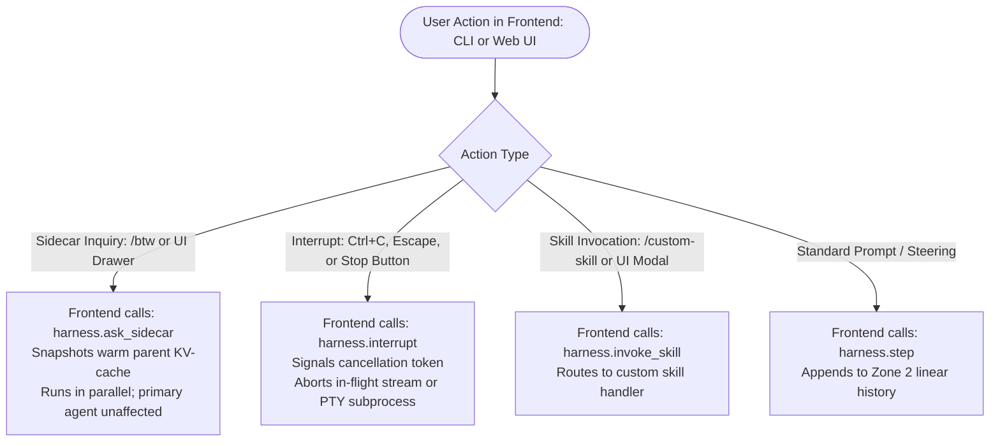
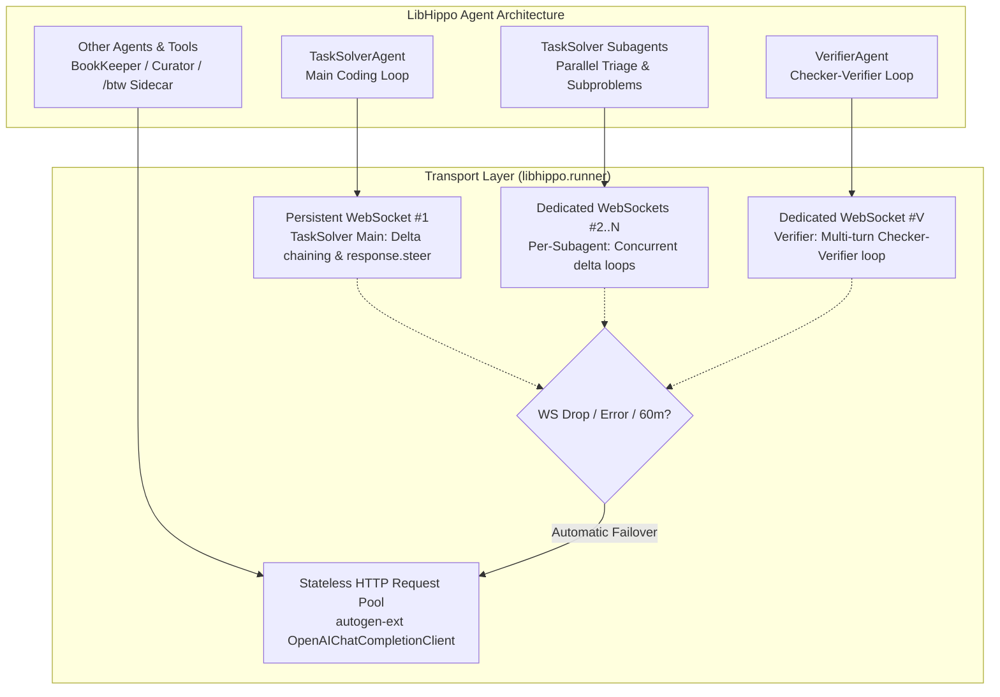
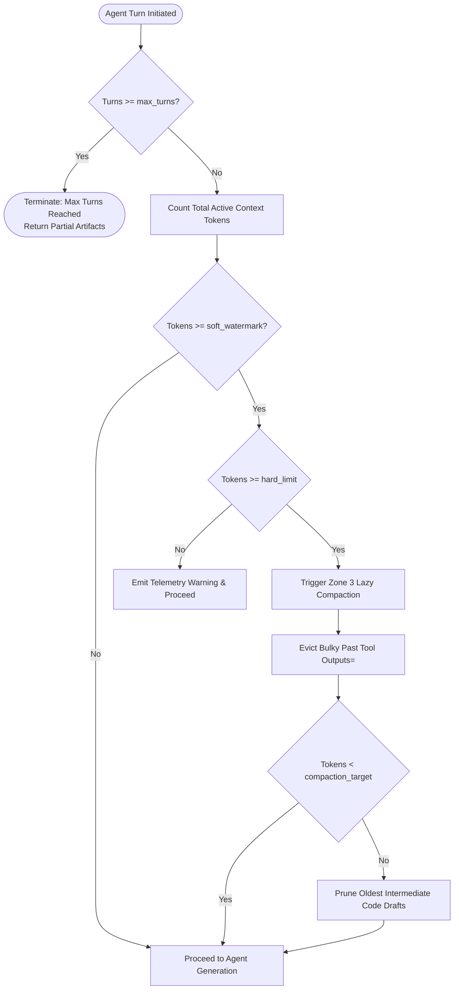
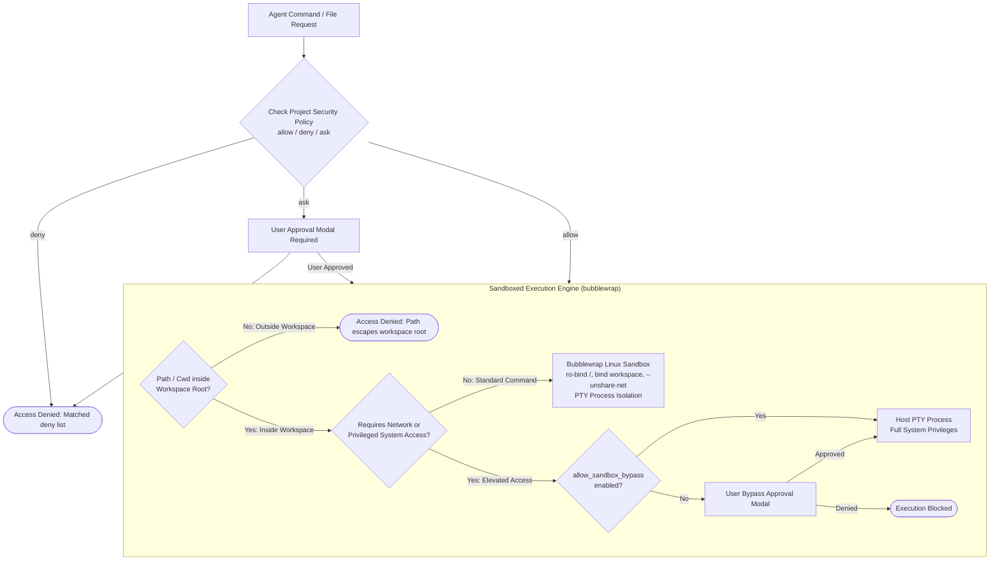
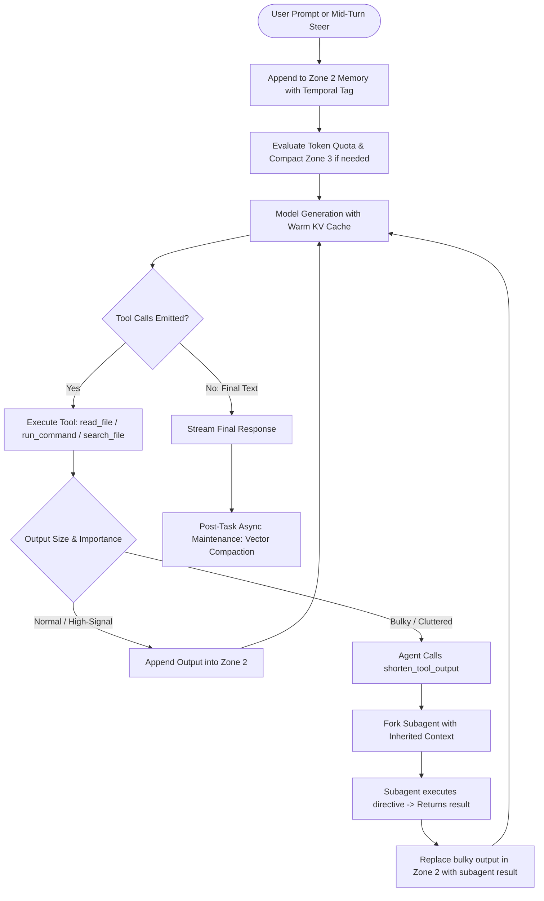
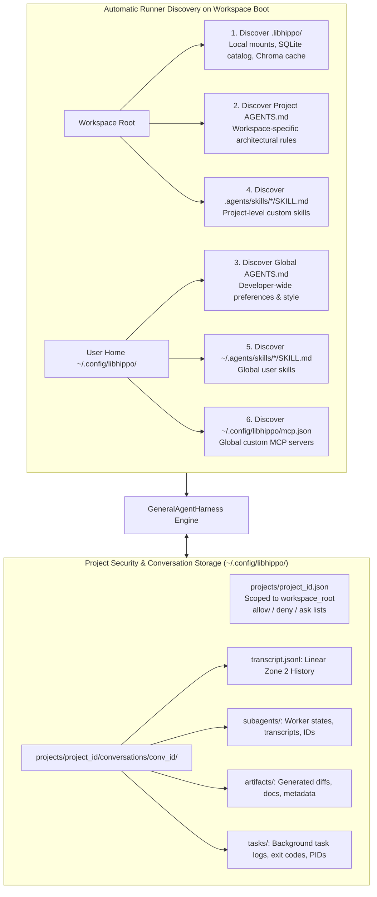

# LibHippo: General Coding Agent Harness Specification
## Runtime Architecture & Autonomous Engineering Harness

> **Target Specification**: General Coding Agent Harness (`libhippo.runner`)  
> **Knowledge Subsystem Reference**: [architecture_knowledge.md](architecture_knowledge.md)  
> **Root Architecture Reference**: [architecture.md](architecture.md)  
> **Design Rationale & Benchmarks**: [design_rationale_and_qa.md](design_rationale_and_qa.md)

---

## 1. Problem Definition & Architectural Scope

Modern autonomous software engineering agents require more than simple chat completions: they operate across complex repositories, execute terminal commands, manage large context windows, inspect and edit multiple files, spawn subagents, and interact with developers.

### 1.1 Decoupled Architecture: Knowledge Management vs. General Agent Harness
LibHippo cleanly decouples into two distinct architectural pillars:
1. **Knowledge Management Subsystem ([`architecture_knowledge.md`](architecture_knowledge.md))**:
   - Cascading knowledge tree with dynamic namespace mounts (`project/`, `common/`, `user/`, `plugins/`).
   - 3-tier adaptive retrieval (`query_knowledge` with low/med/high effort tiers).
   - Maker-Checker lifecycle governance (`CuratorAgent` drafting, `CheckerAgent`/TypeSafe Jev or OpenAI Decisions structural auditing, `VerifierAgent` escalation).
2. **General Coding Agent Harness ([`architecture_harness.md`](architecture_harness.md))**:
   - Comprehensive execution environment for coding agents.
   - Token & workload governors with deterministic compaction.
   - Multi-zone prompt-cache memory architecture.
   - Complete toolset: file operations, pure Python code search, sandboxed terminal execution, web fetch/search, subagent delegation, and interactive user clarification.
   - Reactive, event-driven execution loop with mid-turn steering, LLM-driven tool output shortening/delegation, and background post-task maintenance.
   - The LibHippo knowledge management system integrates seamlessly into this harness as a first-class pluggable toolset.

### 1.2 Modular Engine & Client Decoupling (Backend vs. Frontend)
The harness is engineered as a headless, event-driven engine separated from user-facing clients:
- **Headless Backend Core (`libhippo.runner.GeneralAgentHarness`)**:
  - Implemented as a programmatic Python API with asynchronous event streaming.
  - Emits granular event streams: token chunks, tool call execution events, approval requests for review modes, interactive modal questions, and background process notifications.
- **Frontend Clients (Web UI & CLI)**:
  - **React Web Frontend (`frontend/web`) & Server (`src/libhippo/web`)**:
    - Modern React 19 + TypeScript + Vite SPA backed by `aiohttp.web` async WebSocket (`/ws/events`) and REST server.
    - Full bidirectional streaming: real-time token chunks, expandable tool execution cards, interactive approval gates (`ApprovalRequestEvent`), modal clarification questions (`ask_question`), ephemeral sidecar queries (`/btw`), mid-turn steering (`response.steer`), and interrupts.
    - Complete settings management interface: visual editor for `ProjectSecurityPolicy` (allow/deny/ask rules across read/write/command, network toggle, domain whitelist), tabbed `AGENTS.md` editor (project & global), global MCP configuration (`mcp.json`), and discovered skills catalog.
    - Interactive autocomplete engine with popovers for slash commands (`/btw`, `/steer`, `/stop`, `/<skill>`) and workspace file mentions (`@<path>`).
    - Integrated sandbox task monitor (live PTY stdout/stderr streaming and stdin input), subagent tracker, and knowledge retrieval testbench.

### 1.3 User Command & Control Pipeline: Frontend-Driven Dispatch, `/btw`, and Interrupts
Command parsing is decoupled from the backend core and owned entirely by the **Frontend Layer** (CLI, Web UI, IDE Extension):



- **Frontend Owns Command Ergonomics**:
  - The CLI or Web UI intercepts user keystrokes, input text, or UI triggers.
  - Slash command syntax (e.g. `/btw <query>`) is parsed in the presentation layer before reaching the backend engine. A Web UI may use a dedicated sidecar drawer or quick-action buttons rather than slash commands.
  - The backend engine (`GeneralAgentHarness`) remains headless and exposes programmatic asynchronous methods: `step()`, `ask_sidecar()`, `interrupt()`, and `invoke_skill()`.
  - Commands like `/status` and `/interrupt` are intentionally **omitted** from backend slash command parsers: ambient temporal and system status is already injected via turn metadata and programmatic `get_status()`, while interruption is a first-class cancellation event triggered by UI buttons or terminal signals.

#### 1.3.1 Ephemeral Sidecar Agent for Mid-Run Queries (`/btw`)
- **Use Case**: While the primary agent is running tests, writing files, or executing multi-step reasoning, the user enters `/btw <question>` (e.g. `"/btw why did we choose SQLite over Postgres here?"` or `"/btw which file caused that compiler error?"`).
- **How It Works**:
  1. **Zero Primary Interference**: Does NOT pause, queue behind, or alter the primary agent's active execution plan.
  2. **Read-Only Context Snapshot**: Takes a snapshot of the primary agent's current working context (Zone 1 static prefix + Zone 2 history up to the latest completed turn).
  3. **100% KV-Cache Read Hit**: Because the parent context is **already warm in the model provider's cache**, the sidecar agent executes against the exact same model with a 100% prompt-cache read discount ($0.10\times \sim 0.25\times$), delivering sub-second answers.
  4. **Zero State Pollution**: The sidecar's Q&A stream is rendered to a separate UI pane or side channel. It is not appended to the primary agent's linear history unless the user explicitly promotes it.

#### 1.3.2 Safe Interruption & Cancellation Architecture
When the user triggers an interrupt (via `Ctrl+C`, Escape, or a Web UI Stop button):
1. **Cancellation Event**: An `asyncio.Event` / cancellation token (`interrupt_event`) is signaled across the active runner.
2. **3-State Cancellation Handling**:
   - *During Streaming Generation*: Immediately aborts the HTTP streaming connection (`aclose()`). Partial tokens and reasoning generated up to the interrupt are safely recorded.
   - *During Tool Execution (Subprocess)*: If executing bash inside `run_command`, sends `SIGINT` to the PTY process group (escalating to `SIGKILL` if unresponsive after 1,000ms), flushing captured output to `tasks/<task_id>.log`.
   - *During File Operations*: In-flight atomic writes (`overwrite_file`, `write_file`) complete atomically to prevent file corruption; pending writes in the queue are cancelled.
3. **Context Preservation & Safe Recovery**:
   - The harness appends a clean `<interrupt_event>` tag to Zone 2 preserving what succeeded and what was aborted.
   - The agent transitions to `PAUSED` state. The developer can now steer the agent (*"Stop that approach, try approach Y"*), resume, or revert uncommitted file edits.

#### 1.3.3 Interrupt, Steering (`response.steer`), and Sidecar (`/btw`) Dynamics During Extended Reasoning
Modern reasoning models (such as OpenAI o1, o3, and frontier thinking models) perform extended reasoning bursts that can span several minutes for complex architectural synthesis. The harness supports two distinct steering and cancellation transport modes:

##### Mode A: Native Mid-Turn Steering via WebSocket API (`response.steer`)
On persistent **OpenAI Responses WebSocket connections** (`wss://api.openai.com/v1/responses`), the harness leverages native mid-turn steering without tearing down connections:
1. **Queueing Steering Input**: While generation/reasoning is in-flight, the frontend triggers steering input:
   ```json
   {
     "type": "response.steer",
     "previous_response_id": "resp_active_id",
     "input": "Halt this implementation path; switch to approach Y using SQLite."
   }
   ```
2. **Server Acknowledgment (`response.steer.accepted`)**: The OpenAI server queues the input.
3. **Safe Boundary Transition**:
   - The model finishes its current atomic output segment or tool invocation at a safe boundary.
   - The active response completes with a `response.incomplete` event (`incomplete_details.reason = "steered"`).
4. **Automatic Successor Response (`response.created`)**:
   - The server automatically provisions a **successor response** incorporating the prior context, whatever output/thought trace was generated before the steering cut, and the new steering input.
   - **Zero Reconnection Overhead**: Eliminates client-side context stitching and HTTP reconnect latency; server-side KV-cache stays warm.
5. **Tool Wait Boundary (`response.steer.pending`)**: If the model is awaiting a tool execution or approval, the server holds steering until the tool completes or aborts.

##### Mode B: Standard HTTP/SSE Streaming Mode (`aclose()` Abort + Steering Turn)
When operating over standard stateless HTTP/SSE streaming endpoints:
1. *Immediate Stream Termination*: Calling `harness.interrupt()` closes the underlying HTTP connection (`await response.aclose()`). The provider halts generation, immediately cutting off output token billing.
2. *Partial Trace Capture*: Streamed output chunks and thought summaries received before minute 5 are recorded in Zone 2 inside an `<interrupted_turn duration="5m 02s" status="aborted_by_user">` block.
3. *Prompt Caching on the Steering Turn*: When the user submits steering guidance, the harness sends a fresh request.
4. *KV-Cache Read Hit*: The entire conversation prefix prior to the interrupted turn is **already warm in the provider's prompt cache** (50% discount, near-zero TTFT). The model starts a fresh reasoning burst on the new trajectory.

##### Ephemeral Sidecar Queries (`/btw`) During Extended Reasoning
- While the primary agent is in the middle of a 10-minute thinking run (over either WebSocket or HTTP), `/btw` queries **never block or steer the primary agent**.
- The frontend calls `harness.ask_sidecar(query)`.
- The sidecar launches in a concurrent asynchronous task over a separate channel.
- Reading the snapshot of the parent context (Zone 1 + Zone 2 up to turn start), the sidecar hits the provider's warm prompt cache and returns answers in ~1 second without touching or disturbing the primary agent's deep reasoning.

### 1.4 Tiered Network Transport Architecture: Targeted WebSockets with HTTP Fallback

To minimize client-to-server payload overhead while maintaining complete concurrency isolation, the harness implements a targeted multi-transport topology:



#### 1.4.1 Targeted WebSocket Allocation
1. **TaskSolver (Main & Subagents) $\rightarrow$ Dedicated WebSockets**:
   - **Main TaskSolver Loop**: Anchors a dedicated persistent WebSocket (`wss://api.openai.com/v1/responses`). Turns are linked via `previous_response_id`, transmitting **only the incremental delta** (tool returns / user guidance). This cuts uplink payload sizes by up to ~90% and enables native mid-turn steering (`response.steer`).
   - **TaskSolver Subagents**: Each spawned subagent (e.g. parallel triage workers, subproblem delegates) provisions its **own dedicated WebSocket connection**. This preserves concurrent execution without violating OpenAI's 1-in-flight-response WebSocket invariant, giving every subagent its own delta-chained tool loop.
2. **VerifierAgent $\rightarrow$ Dedicated WebSocket**:
   - `VerifierAgent` governs multi-turn **Checker-Verifier refactoring loops** (collaborative review cycles with `CheckerAgent` and `CuratorAgent` during hierarchy partitioning and AST-level lint auditing).
   - A dedicated persistent WebSocket drastically reduces token re-upload payload across iterative check/verify cycles.
3. **Other Agents & Queries $\rightarrow$ Stateless HTTP**:
   - **`BookKeeperAgent`**: Operates on sub-1k stateless queries (`query_knowledge` fast/medium fallbacks) with Zero-Context isolation; benefits from 0 socket maintenance overhead.
   - **`CuratorAgent`**: Performs one-off web fetches/drafting passes.
   - **`/btw` Sidecar Queries**: Lightweight ephemeral questions execute over HTTP in parallel without blocking or contending with active WebSocket streams.
   - All HTTP clients leverage OpenAI prompt-cache breakpoints for discounted read rates.

#### 1.4.2 AutoGen Built-in Integration & Resilient HTTP Fallback
- **AutoGen Model Client Capabilities**:
  - AutoGen 0.4 (`autogen-ext[openai]`) natively provides `OpenAIChatCompletionClient`, which communicates over **standard HTTP/REST** with SSE streaming. AutoGen does **not** have a built-in WebSocket client for OpenAI LLM inference (WebSockets in AutoGen are used for UI/frontend streaming and MCP tool servers).
  - Therefore, AutoGen's native `OpenAIChatCompletionClient` directly powers:
    1. **All HTTP-based agents**: `BookKeeperAgent`, `CuratorAgent`, `/btw` sidecars, and one-off tool queries.
    2. **Automatic HTTP Fallback**: The resilient fallback path whenever a WebSocket disconnects.
- **Custom Responses Client & WebSocket Adapter (`OpenAIResponsesClient` & `OpenAIResponsesWebSocketClient`)**:
  - Frontier reasoning models require the **OpenAI Responses API (`/v1/responses`)** when combining deep reasoning (`reasoning_effort="medium"` / `"high"`) with function calling tools.
  - LibHippo implements `OpenAIResponsesClient` subclassing AutoGen's `ChatCompletionClient`, which communicates with `POST /v1/responses` preserving full reasoning effort and native function calling.
  - For targeted WebSockets, `OpenAIResponsesWebSocketClient` connects to the Responses WebSocket connection manager, with resilient HTTP failover to `OpenAIResponsesClient`.
- **Failover Triggers & Zero State Loss**:
  - If any active WebSocket connection drops, encounters network resets, or hits OpenAI's connection ceiling, the adapter automatically fails over to `OpenAIResponsesClient` over HTTP.
  - The fallback request submits the cached prefix and delta items to `/v1/responses`, hitting the OpenAI prompt cache with zero developer disruption.

---

## 2. Workload & Token Governor

Autonomous coding agents can easily enter runaway loops or saturate model context windows. The harness enforces strict multi-tier workload boundaries:



### 2.1 Model-Adaptive Context Budgeting
Modern coding models offer 128k–200k (or larger) context windows. Rather than using legacy hardcoded thresholds, the harness calculates dynamic watermarks relative to the active model's window (`max_context_tokens`):

| Threshold Level | Default Ratio (% of Context Window) | 128k / 200k Typical Value | Operational Action |
| :--- | :--- | :--- | :--- |
| **Soft Watermark** | **40% ~ 50%** | $\approx 60{,}000$ tokens | Emits telemetry warning; flags that context growth requires upcoming compaction. |
| **Hard Trigger** | **60% ~ 70%** | $\approx 80{,}000 \sim 100{,}000$ tokens | Halts linear expansion; triggers deterministic Zone 3 tool payload eviction. |
| **Compaction Target** | **25% ~ 30%** | $\approx 30{,}000 \sim 40{,}000$ tokens | Reclaims headroom, reducing active context back down to preserve reasoning sharpness and prevent "Lost in the Middle" degradation. |

### 2.2 Turn & Loop Circuit Breakers
- **Maximum Conversational Turns**: Hard ceiling at 16 turns per task session.
- **Consecutive Tool Failure Threshold**: If an identical tool call fails 3 consecutive times with equivalent errors, execution pauses and triggers an interactive clarification modal (`ask_question`).
- **Command Execution Timeout**: Synchronous shell commands time out after 30,000 ms before auto-backgrounding into tracked background tasks (`manage_task`).

---

## 3. 3-Zone Context Memory Architecture

To maximize provider KV-cache reuse (OpenAI, Anthropic, Gemini) and eliminate redundant token charges, context memory is divided into three strictly regulated zones:

```text
┌────────────────────────────────────────────────────────────────────────┐
│ Zone 1: Immutable Static Prefix (100% Cache Read)                      │
│  - System instructions & agent persona                                 │
│  - Repository profile & workspace layout                               │
│  - Complete tool definitions & schemas                                 │
│  👉 Bitwise identical across turns -> 50~80% latency & cost reduction   │
├────────────────────────────────────────────────────────────────────────┤
│ Zone 2: Append-Only Linear History (KV-Cache Extension Zone)           │
│  - User prompt + Agent reasoning trace (CoT)                           │
│  - Tool calls & raw outputs (file contents, search matches, bash out)  │
│  👉 Strictly monotonic append preserves previous turns' KV-cache       │
├────────────────────────────────────────────────────────────────────────┤
│ Zone 3: Deterministic Snippet Compaction (On Quota Crossing)           │
│  - Evicts bulky past tool outputs (raw file contents, catalog leaves)   │
│  - Replaces payloads with compact pointers: '[Referenced: path]'       │
│  - Never truncates system prompts, user turns, or reasoning traces     │
└────────────────────────────────────────────────────────────────────────┘
```

### 3.1 Zone 1: Immutable Static Prefix
- **Bitwise Guarantee**: No dynamic variables (e.g. wall-clock timestamps, ephemeral session IDs, turn counters) are permitted inside Zone 1.
- **Template Assembly**: Zone 1 is assembled via a template engine from [`harness.md`](src/libhippo/runner/harness.md), which lives directly alongside [`harness.py`](src/libhippo/runner/harness.py). Complicated sections (workspace environment, active rules from `AGENTS.md`, and clean tool categorizations) are embedded dynamically while omitting redundant tool parameter schemas (which are provided directly via function calling). Precise operational contracts for core tools (`read_file`, `write_file`, `overwrite_file`, `run_command`, `shorten_tool_output`, `query_knowledge`, `record_learning`) are explicitly included.
- **Caching Benefit**: Exceeds provider 1,024-token cache thresholds, guaranteeing that all turns within a session read system prompts and tool schemas at 0.25x–0.50x cached rates.

### 3.2 Zone 2: Append-Only Linear History
- **Monotonic Extension**: New turns, tool arguments, and results append strictly to the tail. Existing turns are never modified or re-ordered during normal execution.

### 3.3 Zone 3: Deterministic Compaction
When context crosses the hard compaction threshold ($\approx 80{,}000 \sim 100{,}000$ tokens), the harness executes deterministic multi-stage compaction:

1. **Stage 1 (Tool Output Eviction)**:
   Scans historical tool outputs in Zone 2 marked `is_evictable=True` from oldest to newest:
   - Replaces raw file contents or knowledge leaves with compact reference pointers:
     ```text
     [Referenced: src/libhippo/storage/store.py (lines 1-120)]
     [Referenced: common/web/html/syntax.md (relevance: 0.92)]
     ```
   - Retains full tool call signatures and model reasoning chains. If the agent needs to re-inspect code, it issues a targeted `read_file` slice.

2. **Stage 2 (Conversational History Summarization)**:
   If tool output eviction is insufficient (e.g. context is dominated by non-evictable messages where `is_evictable=False`), `ContextMemory.compact_zone2_summarization()` triggers:
   - **Head-Preserving**: Always retains the initial user intent and problem statement (Turn 0).
   - **Tail-Preserving**: Preserves the most recent active dialogue turns (tail turns, default 3) to maintain immediate working context.
   - **Intermediate Condensation**: Compresses intermediate conversational turns into a high-density `<CONVERSATION_SUMMARY>` XML block, retaining key decisions, attempted hypotheses, and verified outcomes while releasing token headroom.

3. **Tool Output Truncation & Local Logging**:
   - For interactive console logs, tool output is automatically truncated at 1,500 characters to prevent terminal pollution.
   - The unclipped raw logs are simultaneously mirrored to a persistent local log file (`logs/libhippo.log` or configured via `LIBHIPPO_LOG_FILE`).

### 3.4 Turn-Level Metadata Injection (Temporal Awareness without Cache Busting)
- **The Problem with Prefix Timestamps**: Injecting dynamic wall-clock timestamps or user session counters into the system prompt (Zone 1) changes the bitwise prefix on every turn, completely destroying prompt caching.
- **The Solution**: Zone 1 remains 100% invariant. Instead, the harness automatically prefixes incoming user turns in Zone 2 with a lightweight metadata tag:
  ```
  <USER_PROMPT timestamp="2026-10-03T16:47:02+09:00" session_elapsed="14m 20s" branch="main">
  ```
- **Capability**: Enables the agent to evaluate temporal instructions (*"how long did this task take?"*, *"halt after 1 hour"*, *"revert changes from the last 10 minutes"*) with microsecond accuracy while preserving full KV-cache reuse.

---

## 4. General Coding Tool Suite

The harness provides a complete, production-grade tool registry for software engineering:

| Category | Tool Name | Arguments | Description & Operational Contract |
| :--- | :--- | :--- | :--- |
| **Filesystem** | **`read_file`** | `path`, `start_line`, `end_line` | Reads line-addressed file slices (max 800 lines/call). Never loads unbounded files into context. |
| | **`overwrite_file`** | `path`, `content` | Creates a new file or completely overwrites an existing file. Parent directories are auto-created. |
| | **`write_file`** | `path`, `content`, `start_line`, `end_line`, `target` | Targeted file modification: either replaces line range (`start_line` to `end_line`) or exact string match (`target`). |
| | **`delete_file`** | `path` | Safely removes a file, verified against workspace containment and review mode policies. |
| **Exploration** | **`search_file`** | `pattern`, `path`, `glob`, `no_ignore`, `hidden` | Pure Python search respecting `.gitignore` rules, hidden files, and glob filters (no external `rg` binary dependency). |
| | **`list_dir`** | `path`, `depth`, `show_hidden` | Programmatic directory tree traversal up to a specified depth. |
| **Execution** | **`run_command`** | `cmd`, `cwd`, `wait_ms`, `bypass_sandbox` | Executes bash commands with standard output piped to `tasks/<task_id>.log`. Synchronously returns if finished within `wait_ms`; otherwise detaches to background with a reactive completion notification. |
| | **`manage_task`** | `action` ("status"\|"wait"\|"kill"\|"send_input"), `task_id`, `input` | Inspects status, blocks until finished, terminates, or sends stdin to running background processes. |
| **Environment** | **`get_status`** | *None* | Programmatically retrieves current system time, timezone, date, user info, active git branch, and elapsed session duration. |
| **Interaction** | **`ask_question`** | `questions: list[Question]` | Renders an interactive modal with selectable options and custom write-in for clarifying ambiguous user intent. |
| **Subagents** | **`invoke_subagent`** | `type`, `prompt`, `role`, `context_mode`, `model` | Spawns child agents. `context_mode="inherit"` reuses the parent's warmed KV prefix; `context_mode="isolated"` runs clean-slate sub-1k tasks. |
| | **`manage_subagents`**| `action` ("status"\|"wait"\|"kill"), `subagent_id` | Manages child subagent lifecycles and polls completion status. |
| | **`send_message`** | `recipient`, `message` | Inter-agent communication channel between parent harness and running subagents. |
| **Web Research**| **`search_web`** | `query`, `domain` | Searches web engines (DuckDuckGo default, Tavily/Brave pluggable) for external documentation and solutions. |
| | **`fetch_web`** | `url` | Scrapes and converts web pages to clean markdown text. |
| **Knowledge** | **`query_knowledge`** | `query`, `effort`, `criticality` | Plugs in LibHippo's 3-tier adaptive knowledge retriever ([`architecture_knowledge.md`](architecture_knowledge.md)). Mandatory before scaffolding or editing frameworks. |
| | **`record_learning`** | `topic`, `insight`, `scope` | Explicitly queues newly uncovered repository patterns, bug resolutions, or preferences for asynchronous background harvesting. |
| | **`modify_knowledge`**| `action`, `path`, `content`, `metadata`, `extra_paths` | Atomically commits markdown modifications, splits, merges, or deprecations to knowledge mounts, guarded by mount permissions and Maker-Checker validation. |

### 4.1 Output-Aware Tool Execution & Subagent Fan-Out (Tool Virtualization)

When tool (e.g. `run_command("npm run check")`) outputs large diagnostic logs (e.g. 500 lines of errors across 14 files), naively appending the raw output into the active context causes rapid token window exhaustion, destroys prompt-cache alignment, and scatters the agent's focus.

To solve this, the harness intercepts raw tool output and applies an **inline triage classification**. This can be executed via a **Unified Single-Stage LLM Call** (recommended default using a fast model like `gpt-5-nano`) or a **Two-Stage Jev Gatekeeper Pipeline**:

```mermaid
flowchart TD
    ToolExec([run_command completes with output]) --> CheckLen{Output length <= threshold<br>(e.g. <= 30 lines)?}
    CheckLen -- Yes: Short --> AppendZone2[1. short: Append directly into Zone 2<br>Zero classification overhead]
    
    CheckLen -- No: Long --> TriageMethod{Triage Engine}
    
    subgraph SingleStage["Unified Single-Stage (gpt-5-nano) [Recommended]"]
        TriageMethod -->|Single API Call| FastLLM[Fast LLM Triage & Extraction<br>Emits: tier, summary, subproblems]
    end
    
    subgraph TwoStage["Two-Stage Pipeline (Jev + LLM)"]
        TriageMethod -->|Step 1: Judgment| JevFilter[TypeSafe Jev Categorization<br>long-unimportant vs long-important]
        JevFilter -->|Step 2: If important| SubproblemLLM[LLM Subproblem Decomposition]
    end
    
    FastLLM -->|tier == long-unimportant| LongUnimportant[2. long-unimportant:<br>Write raw log to tasks/task-xyz.log<br>Append 2-line summary to Zone 2]
    FastLLM -->|tier == long-important| LongImportant[3. long-important:<br>Decompose into isolated subproblems [a, b, c, ...]]
    
    JevFilter -->|long-unimportant| LongUnimportant
    SubproblemLLM --> LongImportant
    
    LongImportant --> SpawnFanout[Spawn Subagents for each subproblem<br>Context = Cached Parent Prefix + Subproblem Slice]
    SpawnFanout --> SubagentExec[Subagents execute in parallel/sequential<br>Diagnose, edit code, & generate summary]
    SubagentExec --> SynthesizeContext[Replace Parent Tool Output with:<br>[Command input] + [Error overview] + [Subagent summaries]]
    SynthesizeContext --> AppendZone2
```

#### 4.1.1 3-Tier Output Triage
1. **`short`** ($\le 30$ lines / $\le 300$ tokens):
   - Fast path (e.g., `ls -la`, simple git status, minor compiler warning).
   - Appended verbatim into Zone 2 linear history with zero classification or summarization overhead.
2. **`long-unimportant`**:
   - High volume (e.g. massive npm install trace, verbose build telemetry), but does not contain actionable, decoupled task directives.
   - Raw output is preserved out-of-band in task logs (`tasks/<task_id>.log`).
   - Only a compact, structured 2-line outcome summary is injected into Zone 2.
3. **`long-important`**:
   - High volume AND contains actionable, decomposable subproblems (e.g. 500 lines of type errors spanning 14 files, separable into independent clusters $a, b, c$).
   - Decomposes errors into isolated subproblem descriptors: `"{N} files have errors across isolated subproblems: [a, b, c, ...]"`.

#### 4.1.2 Triage Context Scope & Same-Model KV-Cache Sharing
Does the triage router need previous conversation context?
- **Why Previous Context is Critical**:
  - Without conversational history, a router only sees syntax (`"TS2322 in Button.tsx"`). It cannot distinguish whether `Button.tsx` is an unexpected regression caused by the agent's recent edits or an unrelated legacy error, nor can it formulate goal-aligned subproblem directives.
  - Supplying the parent context ensures the triage router understands the user's primary goal, recent diffs, and architectural guidelines.
- **Model Selection & KV-Cache Sharing Strategy**:
  - **Same Model as Parent with Lowered Reasoning Effort (Optimal)**:
    - *The Problem with a Different Model*: If parent runs on `gpt-6.1-sol` (6,000 tokens of context) and dispatches to `gpt-5-nano` with full context, `gpt-5-nano` has a **cold cache**, having to ingest and cache all 6,000 tokens from scratch.
    - *The Same-Model Cache Hit*: Invoking the **same model** as the parent agent inherits the **100% warm KV-cache** of the parent's prefix. Only the new tool output (~500 lines) is processed as fresh tokens.
    - *Dynamic Effort Downgrade*: By adjusting runtime configuration (e.g. `reasoning_effort = "low"`), the triage call runs at ultra-fast speeds and minimal output tokens while retaining 100% prompt cache read discounts.
  - **Stateless Small Model Alternative (`gpt-5-nano`)**:
    - If a dedicated small model is preferred, it must run **stateless** (receiving only `[Initial User Goal]` + `[Command + Error Log]`, $\le 1{,}000$ tokens), completely omitting intermediate conversational history to avoid cold-cache token bloat.

#### 4.1.3 Subagent Fan-Out & KV-Cache Maximization
- **Context Prefix Sharing**: When launching subagents for $a, b, c, ...$:
  - Subagent context = `[Zone 1 Static Prefix] + [Parent Context (before bulky tool output)] + [Subproblem Descriptor + Relevant Error Slice]`.
  - Because the parent context prefix is identical across all child subagents, **all subagents enjoy near-100% KV-cache read hits** on the shared parent history!
- **Concurrency & Collision Prevention**:
  - Subagents run concurrently (or sequentially, per user preference).
  - To prevent concurrent write races on the same files, subproblems are clustered by disjoint file boundaries. If cross-file coupling exists, execution falls back to sequential subagent runs or git-isolated worktrees.
- **Context Replacement & Roll-up**:
  - The parent context never ingests the 500-line raw log.
  - Instead, the subsequent context window appends:
    `[Parent Context] + [run_command("npm run check")] + [Error Decomposition Summary] + [Aggregated Subagent Resolution Summaries]`.
  - The tool execution behaves as a self-contained, delegated subagent orchestrator, maintaining a high-signal, compact context window for the primary agent.

---

## 5. Sandbox & Security Execution Model

The harness implements defense-in-depth isolation for all filesystem and command operations, combining OS-level namespace sandboxing with user-configured security policies:



### 5.1 Sandboxing Engine: Bubblewrap (`bwrap`) on Linux
For command execution, the harness leverages **Bubblewrap (`bwrap`)**, the industry-standard unprivileged, rootless sandboxing technology on Linux:
- **Mount Namespace Isolation**:
  - Host root filesystem is mounted strictly read-only (`--ro-bind / /`).
  - Read-write bind mounts are restricted strictly to permitted paths (`--bind <workspace root> <workspace root>`).
  - An isolated ephemeral `tmpfs` is mounted on `/tmp` (`--tmpfs /tmp`), preventing agents from polluting host temporary storage or exfiltrating data through shared `/tmp`.
  - Minimal `/dev` and fresh `/proc` namespaces (`--dev /dev --proc /proc`).
- **Network Namespace Isolation (`--unshare-net`)**:
  - In standard sandboxed mode, the network namespace is unshared (`--unshare-net`), cutting off all outbound socket connections and local network scanning.
  - Commands requiring internet access (e.g. `npm install`, `curl`, `pip install`) must explicitly set `bypass_sandbox=True`, subject to the project security policy or user approval.
- **PID & IPC Namespace Isolation**:
  - `--unshare-pid` and `--unshare-ipc` isolate agent processes from other host processes and inter-process shared memory segments.
- **Process Group & PTY Management**:
  - Commands execute inside pseudo-terminals (PTY) in isolated process groups (`os.setsid`), multiplexing stdout/stderr into `tasks/<task_id>.log` and enabling deterministic signal escalation (`SIGINT` $\rightarrow$ 1,000ms $\rightarrow$ `SIGKILL`).
- **Graceful Fallback**: If `bwrap` is unavailable on non-Linux hosts, execution falls back to strict Python-level path canonicalization, environment scrubbing, and PTY process boundary containment.

### 5.2 Project Security Policy & User-Directory Isolation
To prevent repository tampering, project security policies are **stored in the user directory** rather than within the project repository:
- **Storage Location**: `~/.config/libhippo/projects/<project_id>.json` (keyed by canonical directory hash or project slug).
- **Security Rationale**: Storing permissions inside the project repository (e.g. `.libhippo/security.json`) would allow an untrusted repository, a malicious Git branch, or an autonomous agent's code edits to unilaterally modify or weaken security policies. Storing it in the user's home configuration directory ensures the policy is immutable to repository contents.
- **Directory Scoping**: Each project configuration is strictly scoped to one directory (`workspace_root`).
- **Fine-Grained Allow / Deny / Ask Lists**:
  - `read_file`: List of path patterns / globs (e.g. `allow: ["src/**", "tests/**"]`, `deny: ["**/.env*", "**/secrets/**"]`, `ask: ["../shared/**"]`).
  - `write_file`: List of path patterns / globs (e.g. `allow: ["src/**", "tests/**"]`, `deny: [".git/**", "package-lock.json"]`).
  - `command`: List of command binary names, prefix rules, or regexes (e.g. `allow: ["uv run pytest*", "git status", "git diff*"]`, `deny: ["rm -rf /*", "curl * | bash"]`, `ask: ["git push*", "npm publish*"]`).
  - `network`: Boolean or domain whitelist (e.g. `allow_domains: ["registry.npmjs.org", "pypi.org"]`).
- **Policy Evaluation Pipeline**:
  1. If any target matches `deny`, the operation is immediately blocked with a security violation.
  2. If the target matches `ask`, an interactive approval modal is presented to the user.
  3. If the target matches `allow`, the operation proceeds automatically into the sandboxed runner.
  4. If unmatched, the active operational mode (`turbo`, `default`, `request_review`) determines whether to prompt the user.

### 5.3 Permission-Driven Sandbox Mounting (`bwrap` Dynamic Flag Synthesis)
All global and project permission configurations (`read`, `write`, `network`) directly dictate the runtime arguments passed to `bwrap`, enforcing defense-in-depth at the Linux kernel namespace layer:

1. **Read Permission Mounting (`read_file`)**:
   - System executables, runtimes, and shared libraries (`/usr`, `/bin`, `/lib`, `/lib64`, `/etc/ssl`) are mounted read-only (`--ro-bind`).
   - Allowed project read directories (`read_file.allow`, including the workspace and knowledge mounts) are mounted read-only (`--ro-bind <path> <path>`).
   - **Kernel-Enforced Read Masking (`read_file.deny`)**:
     - Sensitive paths matching the deny list (e.g. `~/.ssh`, `~/.aws`, `.env`, credentials) are **masked out** in the container mount namespace.
     - `bwrap` mounts empty `tmpfs` overlays (`--tmpfs <denied_path>`) or empty directories (`--dir <denied_path>`) over the target paths, ensuring processes inside the sandbox receive `ENOENT` or empty files and cannot read sensitive host files.
2. **Write Permission Mounting (`write_file`)**:
   - Only explicitly allowed write targets (`write_file.allow`, such as `<workspace root>` and session scratch directory) are mounted read-write (`--bind <path> <path>`).
   - **Read-Only Overlays on Denied Subpaths (`write_file.deny`)**:
     - Critical subdirectories within the writable workspace that are in the deny list (e.g. `.git/`, `package-lock.json`, `.libhippo/cache/`) are **re-mounted read-only** on top (`--ro-bind <workspace>/.git <workspace>/.git`).
     - Any command (e.g. `rm -rf .git`, `git checkout -f`, or an agent script) attempting to modify these files fails at the Linux VFS layer with `EROFS: Read-only file system`.
3. **Network Permission Mounting (`network`)**:
   - When network access is disallowed (`allow_network: false` in global/project policy, or standard sandboxed mode): `bwrap` executes with `--unshare-net`, isolating the network namespace to loopback only.
   - When network access is granted (`allow_network: true` or approved `bypass_sandbox=True`): `bwrap` omits `--unshare-net`, granting access to the host network.
4. **Combined Global & Project Hierarchy**:
   - The runner computes the effective mount table by merging global user defaults (`~/.config/libhippo/permissions.json`) with project-specific overrides (`~/.config/libhippo/projects/<project_id>.json`):
     $$\text{Deny Rules (Highest Priority: Masked)} > \text{Project Mounts} > \text{Global Mount Defaults}$$

### 5.4 Operational Modes: Turbo, Default, and Request Review
The harness configures user oversight via three operational modes:

| Mode | Autonomy Level | Approval Gates & Safety Policy |
| :--- | :--- | :--- |
| **`turbo`** | **Full Autonomy** | All operations matching project `allow` lists or inside workspace boundaries execute without user confirmation modals. Evaluates `deny` list strictly; bypasses `ask` prompts when safe. |
| **`default`** | **Balanced Safety** | Auto-approves operations matching `allow` lists within workspace bounds. Displays user approval modals for unmatched commands, commands attempting to escape `<workspace root>`, network bypass requests (`bypass_sandbox=True`), or rules flagged `ask`. |
| **`request_review`** | **Strict Oversight** | High paranoia mode. Requires explicit user confirmation / interactive diff preview before any file write, file deletion, or shell command execution is executed, regardless of `allow` list status. |

### 5.5 Asynchronous Command Execution Architecture
For long-running tasks (e.g. `npm install`, test suites, dev servers):
1. **Process Launch**: Commands execute within a pseudo-terminal (PTY) inside `bwrap`, with standard output and error multiplexed and streamed into a dedicated task log (`tasks/<task_id>.log`).
2. **Synchronous Wait Ceiling (`wait_ms`)**:
   - If the process completes within `wait_ms` (default 2,000ms), the harness returns output synchronously (`status: "completed", output: "...", exit_code: 0`).
   - If the process is still running after `wait_ms`, execution detaches to a tracked background task, returning `status: "running", task_id: "task-xyz", log_path: "..."` immediately.
3. **Reactive Wakeup (Zero Polling)**:
   - When a detached background process finishes, the harness automatically injects a high-priority system notification into the agent's turn context (`[System Message] Task task-xyz completed with exit code 0. Log output: ...`).
   - The agent never needs to sleep or loop on `manage_task(action="status")`.
4. **Daemon & Interactive Support**:
   - Long-running servers or watchers set `is_daemon=True`.
   - The agent can send input via `manage_task(action="send_input", task_id="...", input="...")` or kill processes via `manage_task(action="kill")`.

### 5.6 Prefix-Matchable Command Shaping
To prevent repetitive user approval prompts, commands must be structured for deterministic prefix-matching:
- Avoid command substitutions (`$(...)` or backticks); run sub-steps as discrete calls.
- Avoid wrapper chaining (`env`, `sudo`, `sh -c "..."`).
- Prefer invoking the target binary directly with literal arguments (e.g. `uv run pytest tests/`).

---

## 6. Reactive Execution Lifecycle & Tool Coordination

Rather than imposing a rigid 5-phase sequential state machine on every query, the harness coordinates engineering reactively:



### 6.1 Reactive Execution Principles
1. **Dynamic Task Scaling**: Simple questions (reading files, checking status) execute in a single round without phase transitions. Complex refactoring tasks dynamically cycle through exploration, editing, test execution, and verification.
2. **Seamless Mid-Turn Steering**: While the agent is reasoning or running tools, user messages automatically steer in-flight execution without tearing down connections or requiring separate commands.
3. **LLM-Driven Output Delegation**: The agent decides whether to preserve verbose outputs in context for long-horizon planning or delegate/shorten them via `shorten_tool_output`.
4. **Asynchronous Post-Task Maintenance**:
   - Runs in the background after turns complete without blocking interactive responses:
     - Dispatches `KnowledgeHarvestObserver` (TypeSafe Jev) to detect novel learnings from recent turn history.
     - Spawns `KnowledgeHarvestSidecar` to draft Hub/Leaf notes from warm KV-cache snapshots and run Maker-Checker governance.
     - Drains explicit `record_learning` queues submitted by `TaskSolverAgent`.
     - Dispatches HNSW vector index compaction (`rebuild_index`) when mutation churn occurs.
     - Cleans up ephemeral scratch resources.
     - Emits turn telemetry (`TurnCompletedEvent`) containing duration, total tokens, `cached_tokens`, and `cache_hit_rate`.

---

## 7. Knowledge Subsystem Bridge

LibHippo's knowledge management system ([`architecture_knowledge.md`](architecture_knowledge.md)) plugs into the general coding agent harness as a specialized, first-class subsystem:

```text
[General Coding Agent Harness]
       │
       ├── Core Tool Registry
       │     ├── read_file, write_file, search_file, run_command ...
       │     ├── query_knowledge (Tool Bridge - Mandatory First Step)
       │     ├── record_learning (Explicit Harvest Queue)
       │     └── complete_retrieval (Deep Search Outcome Bridge)
       │              │
       │              ▼
       │     [LibHippo Knowledge Subsystem (architecture_knowledge.md)]
       │     ├── Dynamic Namespace Mount Router
       │     │     ├── /project  ==> <workspace>/.libhippo/ (RW)
       │     │     ├── /common   ==> <install>/knowledge/common/ (RW)
       │     │     ├── /user     ==> ~/.config/libhippo/ (RW)
       │     │     └── /plugins  ==> dynamic plugin directories (RO/RW)
       │     ├── 3-Tier Adaptive Retrieval (Low / Med / High)
       │     └── Maker-Checker Governance (Curator/Sidecar + Checker/Jev + Verifier)
       │
       └── Post-Task Maintenance Hook
             ├── KnowledgeHarvestObserver (TypeSafe Jev Semantic Gating)
             ├── KnowledgeHarvestSidecar (Warm-Cache Draft & Governance Commit)
             └── rebuild_index (Async Vector Compaction)
```

1. **Tool Exposure**: The harness registers `query_knowledge` in Zone 1 tool definitions, strictly enforcing coarse-to-fine knowledge lookups before modifying or scaffolding frameworks.
2. **Context Harvesting**: Problem-solving discoveries (compiler error fixes, internal patterns, user preferences) are captured either explicitly via `record_learning` or autonomously through `KnowledgeHarvestObserver` and synthesized in the background by `KnowledgeHarvestSidecar`.
3. **Mount Protection & Evolution**: `project`, `common`, and `user` are Read/Write, allowing both project rules and shared language/framework knowledge (e.g. React updates) to be updated via Maker-Checker governance. Mounts flagged `read_only: true` (e.g. third-party plugin packages) are protected from disk mutations, prompting project-level specialization.
4. **Background Compaction Hook**: The harness calls `VectorKnowledgeStore.compact_if_needed()` during maintenance without blocking interactive user turns.

---

## 8. Automatic Discovery, Skills Convention, Global MCP, and Conversation Persistence

To provide seamless developer ergonomics without manual configuration, the harness integrates automatic workspace discovery, standardized skill conventions, global MCP extensibility, and persistent multi-session conversation tracking:



### 8.1 Automatic Runner Discovery
On initialization, `GeneralAgentHarness` automatically traverses the environment to discover and load contextual assets:
1. **`.libhippo` Project Directory**:
   - Discovers `<workspace_root>/.libhippo/` containing project-scoped knowledge (`project/`), SQLite catalog caches, and ChromaDB vector indices.
   - Automatically registers the `project/` mount into the harness's internal `KnowledgeStore`.
2. **Global & Project `AGENTS.md`**:
   - **Global User Rules**: Discovers `~/.config/libhippo/AGENTS.md` (or `~/.gemini/config/AGENTS.md`) containing developer-wide conventions, editor settings, and language preferences.
   - **Project Rules**: Discovers `<workspace_root>/AGENTS.md` containing repository-specific guidelines, testing commands, and architecture rules.
   - Both rule sets are parsed and injected into the immutable Zone 1 static prefix in a deterministic, hierarchical order:
     $$\text{Project AGENTS.md (Highest Precedence)} > \text{Global AGENTS.md}$$
3. **General `.agents` Convention for Skill Discovery**:
   - Follows the industry-standard `.agents/skills` directory convention:
     - Project Skills: `<workspace_root>/.agents/skills/<skill_name>/SKILL.md`
     - Global Skills: `~/.agents/skills/<skill_name>/SKILL.md` (or `~/.config/libhippo/skills/<skill_name>/SKILL.md`)
   - Each skill directory contains:
     - `SKILL.md`: Main instruction file with YAML frontmatter (`name`, `description`) and markdown guidelines.
     - Optional helper scripts, reference docs, and templates.
   - **Command-Based Invocation (`/<skill-name>`)**:
     - Discovered skills are exposed as executable slash commands in the frontend: e.g. `/custom-skill`, `/migrate-workflows`.
     - The frontend intercepts slash commands and dispatches them directly via `harness.invoke_skill(name, args)`.
4. **Custom Model Context Protocol (MCP) Support (Configured Globally)**:
   - Configured centrally in the user configuration directory: `~/.config/libhippo/mcp.json`.
   - Uses the official MCP configuration specification:
     ```json
     {
       "mcpServers": {
         "github": {
           "command": "npx",
           "args": ["-y", "@modelcontextprotocol/server-github"],
           "env": { "GITHUB_PERSONAL_ACCESS_TOKEN": "..." }
         },
         "postgres": {
           "command": "python",
           "args": ["-m", "mcp_server_postgres", "--connection-string", "..."]
         }
       }
     }
     ```
   - On harness boot, all globally configured MCP servers are spawned via stdio/SSE clients, their declared tools and schemas are dynamically retrieved, and they are registered into the harness `ToolRegistry` alongside native coding tools.
5. **Environment Variable Loading Hierarchy (`python-dotenv`)**:
   - Discovers and loads environment variables from standard `.env` combinations in priority order (highest to lowest, with existing shell variables preserved):
     1. `.env.<environment>.local` (e.g. `.env.development.local`, `.env.production.local`)
     2. `.env.local`
     3. `.env.<environment>` (e.g. `.env.development`, `.env.production`)
     4. `.env`
   - Active environment is determined by `LIBHIPPO_ENV`, `APP_ENV`, `NODE_ENV`, or defaults to `development`.
   - Also inspects user configuration directory `~/.config/libhippo/` as a fallback environment directory.
   - Handled via `python-dotenv` before initializing LLM clients and runner subsystems.

### 8.2 Persisted Conversation Architecture
Conversations are first-class, durable entities grouped cleanly under each project:
- **Storage Layout**:
  - Project configuration: `~/.config/libhippo/projects/<project_id>.json`
  - Conversations directory: `~/.config/libhippo/projects/<project_id>/conversations/<conversation_id>/`
- **Persisted State Entities**:
  1. **Conversation Metadata (`metadata.json`)**:
     - Persists conversation identification and tracking: `id`, `name`, `created_at`, `updated_at`, and arbitrary metadata tags.
     - **Automatic Naming**: Automatically extracts and assigns a concise, readable conversation title upon the first user prompt (or updates it if unnamed).
  2. **Zone 2 History (`transcript.jsonl`)**:
     - Monotonically appended JSONL stream capturing every user turn, temporal metadata tag, assistant reasoning trace, tool invocation, and tool output.
  2. **Subagent Registry (`subagents/`)**:
     - Tracks all spawned child workers: conversation IDs, worker roles, execution states (`running`, `idle`, `completed`, `errored`), transcripts, and parent-child linkage.
     - Enables resuming or inspecting subagents across CLI sessions or UI reconnects.
  3. **Artifacts Store (`artifacts/`)**:
     - Persists structured reports, architecture proposals, implementation plans, and code diffs.
     - Records artifact metadata: `Summary`, `UserFacing: bool`, and `RequestFeedback: bool`.
  4. **Background Tasks (`tasks/`)**:
     - Persists long-running detached process metadata: `task_id`, command string, working directory, process PID, start timestamp, exit code, and stdout/stderr stream logs (`tasks/<task_id>.log`).
     - Allows users and agents to reconnect, query status, or send input to running daemons across disconnections.
- **Session Restoration & Web UI Synchronization**:
  - `GeneralAgentHarness` auto-resumes the active conversation or latest non-empty session on boot, repopulating Zone 2 linear history and turn governors.
  - Exposes programmatic APIs (`load_conversation`, `new_conversation`, `list_conversations`) and HTTP/WS endpoints (`GET /api/conversations`, `GET /api/conversations/{id}`, `POST /api/conversations/{id}/load`, `PATCH /api/conversations/{id}`).
  - WebSocket initial handshake (`connection_established`) and `/api/session` include `conversation_name`, `conversation_metadata`, and structured `chat_messages` so web clients immediately restore titles, metadata, and full conversation histories across reloads.
