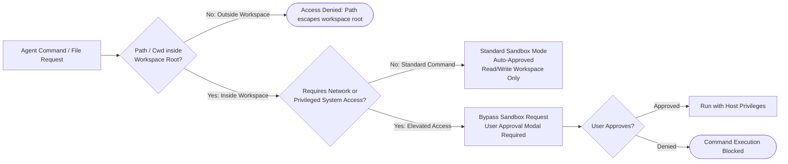
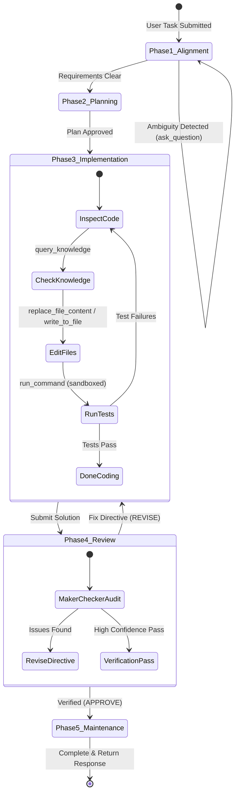

# LibHippo: General Coding Agent Harness Specification
## Runtime Architecture & Autonomous Engineering Harness

> **Target Specification**: General Coding Agent Harness (`libhippo.runner`)  
> **Knowledge Subsystem Reference**: [architecture.md](architecture.md)  
> **Design Rationale & Benchmarks**: [design_rationale_and_qa.md](design_rationale_and_qa.md)  
> **Harness Implementation Plan**: [`plan_agent_harness_architecture_implementation.md`](file:///home/lhwdev/.gemini/antigravity/brain/2ed237fb-f6ad-4b4b-8d82-9e80eec1acf2/plan_agent_harness_architecture_implementation.md)

---

## 1. Problem Definition & Architectural Scope

Modern autonomous software engineering agents require more than simple chat completions: they operate across complex repositories, execute terminal commands, manage large context windows, inspect and edit multiple files, spawn subagents, and interact with developers.

### 1.1 Decoupled Architecture: Knowledge Management vs. General Agent Harness
LibHippo cleanly decouples into two distinct architectural pillars:
1. **Knowledge Management Subsystem ([`architecture.md`](architecture.md))**:
   - Cascading knowledge tree with dynamic namespace mounts (`project/`, `common/`, `user/`, `plugins/`).
   - 3-tier adaptive retrieval (`query_knowledge` with low/med/high effort tiers).
   - Maker-Checker lifecycle governance (`CuratorAgent` drafting, `CheckerAgent`/TypeSafe Jev structural auditing, `VerifierAgent` escalation).
2. **General Coding Agent Harness ([`architecture_runner.md`](architecture_runner.md))**:
   - Comprehensive execution environment for coding agents.
   - Token & workload governors with deterministic compaction.
   - Multi-zone prompt-cache memory architecture.
   - Complete toolset: file operations, ripgrep code search, sandboxed terminal execution, web fetch/search, subagent delegation, and interactive user clarification.
   - Phased workflow harness: Task Alignment $\rightarrow$ Planning $\rightarrow$ Implementation $\rightarrow$ Review & Verification $\rightarrow$ Post-Task Maintenance.
   - The LibHippo knowledge management system integrates seamlessly into this harness as a first-class pluggable toolset.

---

## 2. Workload & Token Governor

Autonomous coding agents can easily enter runaway loops or saturate model context windows. The harness enforces strict multi-tier workload boundaries:

```mermaid
flowchart TD
    TurnStart([Agent Turn Initiated]) --> CheckTurns{Turns >= max_turns (16)?}
    CheckTurns -- Yes --> TerminateTurnLimit([Terminate: Max Turns Reached<br>Return Partial Artifacts])
    CheckTurns -- No --> CountTokens[Count Total Active Context Tokens]
    
    CountTokens --> CheckSoft{Tokens >= soft_watermark (6,000)?}
    CheckSoft -- No --> NormalExecution[Proceed to Agent Generation]
    CheckSoft -- Yes --> CheckHard{Tokens >= hard_limit (8,000)?}
    CheckHard -- No --> WarnTelemetry[Emit Telemetry Warning & Proceed]
    CheckHard -- Yes --> TriggerCompaction[Trigger Zone 3 Lazy Compaction]
    TriggerCompaction --> EvictPayloads[Evict Bulky Past Tool Outputs<br>Replace with [Referenced: path]]
    EvictPayloads --> VerifyReduction{Tokens < compaction_target (4,000)?}
    VerifyReduction -- Yes --> NormalExecution
    VerifyReduction -- No --> PruneDrafts[Prune Oldest Intermediate Code Drafts]
    PruneDrafts --> NormalExecution
```

### 2.1 Context Token Watermarks
- **Soft Watermark ($6{,}000$ tokens)**: Telemetry warning; flags that context growth requires upcoming eviction.
- **Hard Compaction Limit ($8{,}000$ tokens)**: Halts linear expansion; triggers deterministic Zone 3 payload compaction.
- **Compaction Target ($4{,}000$ tokens)**: Reclaims context space so the agent retains at least 50% headroom for code generation.

### 2.2 Turn & Loop Circuit Breakers
- **Maximum Conversational Turns**: Hard ceiling at 16 turns per task session.
- **Consecutive Tool Failure Threshold**: If an identical tool call fails 3 consecutive times with equivalent errors, execution pauses and triggers an interactive clarification modal (`ask_question`).
- **Command Execution Timeout**: Synchronous shell commands time out after 30,000 ms before auto-backgrounding into tracked background tasks (`manage_task`).

---

## 3. 3-Zone Context Memory Architecture

To maximize provider KV-cache reuse (OpenAI, Anthropic, Gemini) and eliminate redundant token charges, context memory is divided into three strictly regulated zones:

```text
┌────────────────────────────────────────────────────────────────────────┐
│ Zone 1: Immutable Static Prefix (100% Cache Read)                      │
│  - System instructions & agent persona                                 │
│  - Repository profile & workspace layout                               │
│  - Complete tool definitions & schemas                                 │
│  👉 Bitwise identical across turns -> 50~80% latency & cost reduction   │
├────────────────────────────────────────────────────────────────────────┤
│ Zone 2: Append-Only Linear History (KV-Cache Extension Zone)           │
│  - User prompt + Agent reasoning trace (CoT)                           │
│  - Tool calls & raw outputs (file contents, ripgrep matches, bash out) │
│  👉 Strictly monotonic append preserves previous turns' KV-cache       │
├────────────────────────────────────────────────────────────────────────┤
│ Zone 3: Deterministic Snippet Compaction (On Quota Crossing)           │
│  - Evicts bulky past tool outputs (raw file contents, catalog leaves)   │
│  - Replaces payloads with compact pointers: '[Referenced: path]'       │
│  - Never truncates system prompts, user turns, or reasoning traces     │
└────────────────────────────────────────────────────────────────────────┘
```

### 3.1 Zone 1: Immutable Static Prefix
- **Bitwise Guarantee**: No dynamic variables (e.g. wall-clock timestamps, ephemeral session IDs, turn counters) are permitted inside Zone 1.
- **Caching Benefit**: Exceeds provider 1,024-token cache thresholds, guaranteeing that all turns within a session read system prompts and tool schemas at 0.25x–0.50x cached rates.

### 3.2 Zone 2: Append-Only Linear History
- **Monotonic Extension**: New turns, tool arguments, and results append strictly to the tail. Existing turns are never modified or re-ordered during normal execution.

### 3.3 Zone 3: Deterministic Compaction
When context crosses the $8{,}000$-token threshold, the harness scans historical tool outputs in Zone 2 from oldest to newest:
- Replaces raw file contents or knowledge leaves with reference pointers:
  ```text
  [Referenced: src/libhippo/storage/store.py (lines 1-120)]
  [Referenced: common/web/html/syntax.md (relevance: 0.92)]
  ```
- Retains full tool call signatures and model reasoning chains. If the agent needs to re-inspect code, it issues a targeted `view_file` slice.

---

## 4. General Coding Tool Suite

The harness provides a complete, production-grade tool registry for software engineering:

| Category | Tool Name | Arguments | Description & Operational Contract |
| :--- | :--- | :--- | :--- |
| **Filesystem** | **`view_file`** | `AbsolutePath`, `StartLine`, `EndLine`, `ContentOffset` | Reads line-addressed file slices (max 800 lines/call). Never loads unbounded files into context. |
| | **`write_to_file`** | `TargetFile`, `CodeContent`, `Overwrite`, `Append` | Creates or atomically overwrites complete files, auto-creating parent directories. |
| | **`replace_file_content`** | `TargetFile`, `TargetContent`, `ReplacementContent`, `StartLine`, `EndLine` | Replaces an exact contiguous block of code within a bounded line range. Enforces exact character matching. |
| **Exploration** | **`search_code`** | `pattern`, `path`, `glob`, `flags` | High-speed code search utilizing `rg` (ripgrep). Returns file paths, line numbers, and matching lines. |
| | **`list_dir`** | `path`, `depth`, `show_hidden` | Inspects directory structure and hierarchy up to a specified depth. |
| **Execution** | **`run_command`** | `CommandLine`, `Cwd`, `WaitMsBeforeAsync`, `BypassSandbox` | Executes shell commands in bash. Synchronous wait up to `WaitMsBeforeAsync`; transitions to background task if long-running. |
| | **`manage_task`** | `Action` ("status"\|"kill"\|"send_input"), `TaskId`, `Input` | Manages long-running or background processes (dev servers, test watchers, builds). |
| **Interaction** | **`ask_question`** | `questions: list[Question]` | Renders an interactive modal with selectable options and custom write-in for clarifying ambiguous user intent. |
| **Subagents** | **`invoke_subagent`** | `TypeName`, `Role`, `Prompt`, `Model`, `Workspace` | Spawns specialized child agents (`research`, `reviewer`) with isolated context and workspace branching. |
| | **`send_message`** | `Recipient`, `Message` | Inter-agent communication channel between parent harness and running subagents. |
| **Web Research**| **`search_web`** | `query`, `domain` | Searches web engines (DuckDuckGo default, Tavily/Brave pluggable) for external documentation and solutions. |
| | **`fetch_web`** | `url` | Scrapes and converts web pages to clean markdown text. |
| **Knowledge** | **`query_knowledge`** | `query`, `effort`, `criticality` | Plugs in LibHippo's 3-tier adaptive knowledge retrieval system ([`architecture.md`](architecture.md)). |

---

## 5. Sandbox & Security Execution Model

The harness implements defense-in-depth isolation for all filesystem and command operations:



### 5.1 Workspace Boundary Containment
- **Working Directory (`Cwd`) Enforcement**: `Cwd` must always resolve within `<workspace root>`. Commands attempting to run in `/tmp`, `/home`, or system root are blocked.
- **Path Sanitization**: Absolute paths are verified to reside inside the workspace or the designated session scratch directory (`<appDataDir>/brain/<conversation_id>/scratch/`).

### 5.2 Dual Sandbox Execution Modes
1. **Standard Sandbox Mode (`BypassSandbox: false`)**:
   - Default mode.
   - Full read/write access strictly to the project workspace and session scratch directory.
   - Network access is disabled.
   - Commands are auto-approved without manual user prompts.
2. **Bypass Sandbox Mode (`BypassSandbox: true`)**:
   - Disables filesystem and network isolation.
   - **Requires explicit user approval** via UI prompt.
   - Reserved strictly for operations needing external network or system binaries.

### 5.3 Prefix-Matchable Command Shaping
To prevent repetitive user approval prompts, commands must be structured for deterministic prefix-matching:
- Avoid command substitutions (`$(...)` or backticks); run sub-steps as discrete calls.
- Avoid wrapper chaining (`env`, `sudo`, `sh -c "..."`).
- Prefer invoking the target binary directly with literal arguments (e.g. `uv run pytest tests/`).

---

## 6. Phased Harness Lifecycle & Coordination

The harness coordinates autonomous engineering through five explicit lifecycle phases:



### Phase 1: Task Alignment & Requirement Clarification
- Inspects repository structure, existing conventions, and issue descriptions.
- If requirements are underspecified or design trade-offs exist, the harness invokes `ask_question` to align with the developer before generating code.

### Phase 2: Architectural Planning
- Formulates a step-by-step implementation strategy.
- Identifies candidate files to modify, new files to create, and potential breaking changes.
- Issues `query_knowledge` calls to retrieve relevant project and domain standards from the mounted LibHippo knowledge namespaces.

### Phase 3: Implementation & Coding
- Edits files using precise line-addressed tools (`replace_file_content`).
- Executes incremental builds, linter checks, and unit tests via `run_command`.
- Tracks modified files in session working memory.

### Phase 4: Review & Verification
- Executes full test suites and static analysis tools.
- Optionally spawns an isolated `reviewer` subagent or Maker-Checker audit.
- If defects or deprecations are detected, loops back to Phase 3 with concrete fix directives.

### Phase 5: Post-Task Maintenance
- Runs asynchronously after the user response is delivered:
  - Dispatches HNSW vector index compaction (`rebuild_index`) if mutation churn threshold is met.
  - Cleans up ephemeral scratch files.
  - Emits telemetry metrics (tokens used, cache hit ratios, tool latencies).

---

## 7. Knowledge Subsystem Bridge

LibHippo's knowledge management system ([`architecture.md`](architecture.md)) plugs into the general coding agent harness as a specialized, first-class subsystem:

```text
[General Coding Agent Harness]
       │
       ├── Core Tool Registry
       │     ├── view_file, replace_file_content, run_command ...
       │     └── query_knowledge (Tool Bridge)
       │              │
       │              ▼
       │     [LibHippo Knowledge Subsystem (architecture.md)]
       │     ├── Dynamic Namespace Mount Router
       │     │     ├── /project  ==> <workspace>/.libhippo/ (RW)
       │     │     ├── /common   ==> <install>/knowledge/common/ (RW)
       │     │     ├── /user     ==> ~/.config/libhippo/ (RW)
       │     │     └── /plugins  ==> dynamic plugin directories (RO/RW)
       │     ├── 3-Tier Adaptive Retrieval (Low / Med / High)
       │     └── Maker-Checker Governance (Curator + Checker/Jev + Verifier)
       │
       └── Post-Task Maintenance Hook
             └── rebuild_index (Async Vector Compaction)
```

1. **Tool Exposure**: The harness registers `query_knowledge` in Zone 1 tool definitions, enabling the agent to perform coarse-to-fine knowledge lookups at any stage.
2. **Mount Protection & Evolution**: `project`, `common`, and `user` are Read/Write, allowing both project rules and shared language/framework knowledge (e.g. React updates) to be updated via Maker-Checker governance. Mounts flagged `read_only: true` (e.g. third-party plugin packages) are protected from disk mutations, prompting project-level specialization.
3. **Background Compaction Hook**: The harness calls `VectorKnowledgeStore.compact_if_needed()` during Phase 5 maintenance without blocking interactive user turns.

---

## 8. Python Class Contracts & Harness Interfaces

```python
from __future__ import annotations

from abc import ABC, abstractmethod
from dataclasses import dataclass, field
from enum import Enum
from pathlib import Path
from typing import Any, Callable, Coroutine, Literal
from pydantic import BaseModel, Field


class ExecutionMode(str, Enum):
    SANDBOXED = "sandboxed"
    BYPASS = "bypass"


class HarnessConfig(BaseModel):
    """Runtime configuration for the General Coding Agent Harness."""

    model: str = "gpt-4o"
    temperature: float = Field(default=0.2, ge=0.0, le=1.0)
    workspace_root: Path = Field(default_factory=Path.cwd)
    soft_token_watermark: int = 6000
    hard_token_limit: int = 8000
    compaction_target_tokens: int = 4000
    max_turns: int = 16
    command_timeout_ms: int = 30000
    allow_sandbox_bypass: bool = False


@dataclass
class ContextMessage:
    """Represents a message within the 3-Zone context structure."""

    role: Literal["system", "user", "assistant", "tool"]
    content: str
    zone: Literal["zone1_prefix", "zone2_linear", "zone3_compacted"]
    tool_call_id: str | None = None
    file_path_reference: str | None = None
    raw_token_count: int = 0
    is_evictable: bool = False


@dataclass
class ToolDefinition:
    """Schema and handler binding for a harness tool."""

    name: str
    description: str
    parameters_schema: dict[str, Any]
    handler: Callable[..., Coroutine[Any, Any, Any]]
    requires_sandbox_bypass: bool = False


class SandboxRunner(ABC):
    """Execution sandbox enforcing workspace boundary isolation."""

    @abstractmethod
    async def run_command(
        self,
        command_line: str,
        cwd: Path,
        wait_ms: int = 2000,
        bypass_sandbox: bool = False,
    ) -> dict[str, Any]:
        """Execute a shell command with security boundary enforcement."""
        ...

    @abstractmethod
    def validate_path(self, path: Path) -> Path:
        """Verify that path resides strictly inside workspace_root."""
        ...


class GeneralAgentHarness:
    """Production-grade execution harness for autonomous software engineering."""

    def __init__(
        self,
        config: HarnessConfig | None = None,
        sandbox: SandboxRunner | None = None,
    ) -> None:
        self.config = config or HarnessConfig()
        self.sandbox = sandbox
        self.zone1_prefix: list[ContextMessage] = []
        self.zone2_history: list[ContextMessage] = []
        self.tools: dict[str, ToolDefinition] = {}
        self.current_phase: str = "alignment"

    def register_tool(self, tool: ToolDefinition) -> None:
        """Register a core coding or knowledge tool into the harness."""
        self.tools[tool.name] = tool

    def init_prefix(self, system_persona: str, repo_profile: str) -> None:
        """Initialize Zone 1 with immutable specifications for 100% KV-cache reuse."""
        ...

    async def step(self, user_input: str) -> str:
        """Execute one conversational round through the 5-phase harness."""
        ...

    def compact_context(self) -> int:
        """Execute deterministic Zone 3 eviction on past tool outputs when quota is crossed."""
        ...

    async def post_task_maintenance(self) -> None:
        """Execute background maintenance (e.g. vector compaction) after task completion."""
        ...
```
