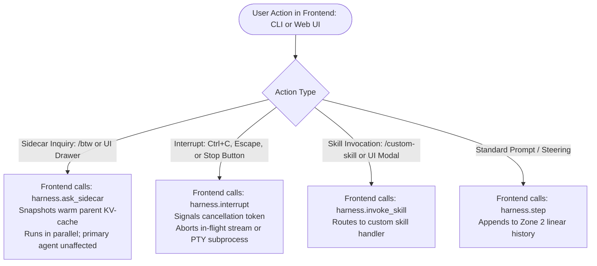
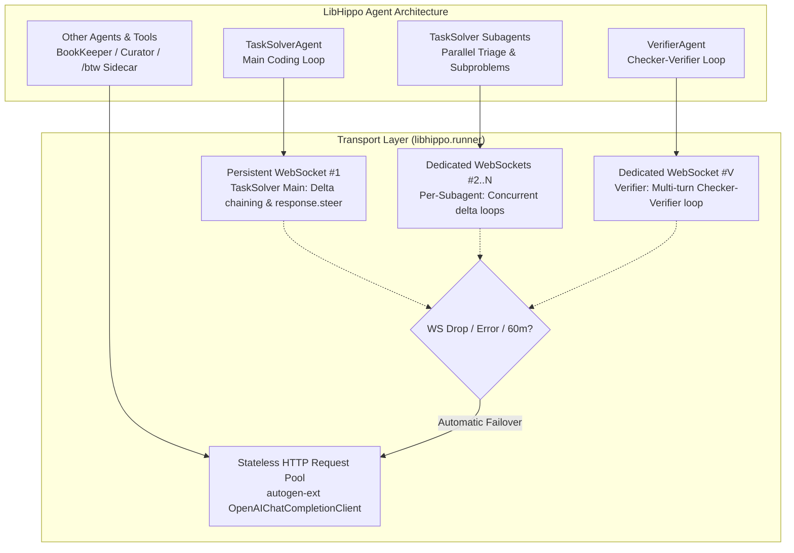
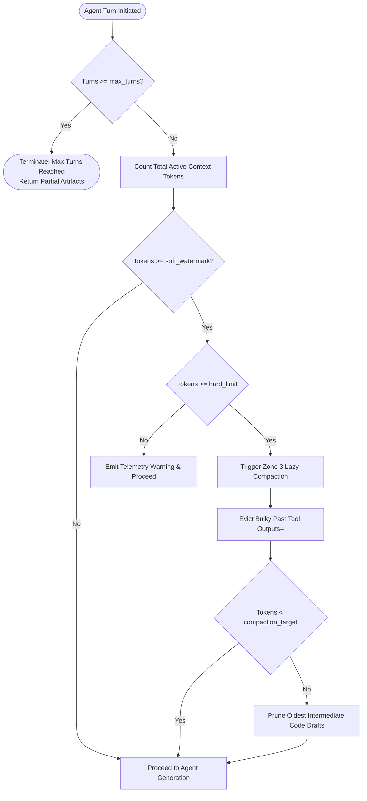
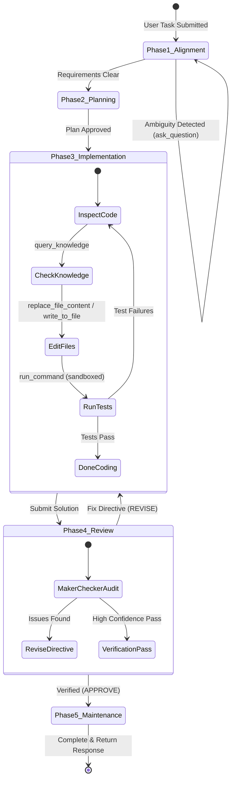

# LibHippo: General Coding Agent Harness Specification
## Runtime Architecture & Autonomous Engineering Harness

> **Target Specification**: General Coding Agent Harness (`libhippo.runner`)  
> **Knowledge Subsystem Reference**: [architecture.md](architecture.md)  
> **Design Rationale & Benchmarks**: [design_rationale_and_qa.md](design_rationale_and_qa.md)  
> **Harness Implementation Plan**: [`plan_agent_harness_architecture_implementation.md`](file:///home/lhwdev/.gemini/antigravity/brain/2ed237fb-f6ad-4b4b-8d82-9e80eec1acf2/plan_agent_harness_architecture_implementation.md)

---

## 1. Problem Definition & Architectural Scope

Modern autonomous software engineering agents require more than simple chat completions: they operate across complex repositories, execute terminal commands, manage large context windows, inspect and edit multiple files, spawn subagents, and interact with developers.

### 1.1 Decoupled Architecture: Knowledge Management vs. General Agent Harness
LibHippo cleanly decouples into two distinct architectural pillars:
1. **Knowledge Management Subsystem ([`architecture.md`](architecture.md))**:
   - Cascading knowledge tree with dynamic namespace mounts (`project/`, `common/`, `user/`, `plugins/`).
   - 3-tier adaptive retrieval (`query_knowledge` with low/med/high effort tiers).
   - Maker-Checker lifecycle governance (`CuratorAgent` drafting, `CheckerAgent`/TypeSafe Jev structural auditing, `VerifierAgent` escalation).
2. **General Coding Agent Harness ([`architecture_runner.md`](architecture_runner.md))**:
   - Comprehensive execution environment for coding agents.
   - Token & workload governors with deterministic compaction.
   - Multi-zone prompt-cache memory architecture.
   - Complete toolset: file operations, ripgrep code search, sandboxed terminal execution, web fetch/search, subagent delegation, and interactive user clarification.
   - Phased workflow harness: Task Alignment $\rightarrow$ Planning $\rightarrow$ Implementation $\rightarrow$ Review & Verification $\rightarrow$ Post-Task Maintenance.
   - The LibHippo knowledge management system integrates seamlessly into this harness as a first-class pluggable toolset.

### 1.2 Modular Engine & Client Decoupling (Backend vs. Frontend)
The harness is engineered as a headless, event-driven engine separated from user-facing clients:
- **Headless Backend Core (`libhippo.runner.GeneralAgentHarness`)**:
  - Implemented as a programmatic Python API with asynchronous event streaming.
  - Emits granular event streams: token chunks, tool call execution events, approval requests for review modes, interactive modal questions, and background process notifications.
  - **Web API Ready**: The Python async API translates directly into REST/FastAPI endpoints, WebSockets, or Server-Sent Events (SSE) as-is for remote or browser workspaces.
- **Frontend Clients (CLI & Web UI)**:
  - *Deferred Implementation*: Terminal CLI (similar to `claude` / `agy` CLI) and Web UI will consume the backend's event stream.
  - The core harness maintains zero dependencies on presentation layers, UI frameworks, or terminal formatting.

### 1.3 User Command & Control Pipeline: Frontend-Driven Dispatch, `/btw`, and Interrupts
Command parsing is decoupled from the backend core and owned entirely by the **Frontend Layer** (CLI, Web UI, IDE Extension):



- **Frontend Owns Command Ergonomics**:
  - The CLI or Web UI intercepts user keystrokes, input text, or UI triggers.
  - Slash command syntax (e.g. `/btw <query>`) is parsed in the presentation layer before reaching the backend engine. A Web UI may use a dedicated sidecar drawer or quick-action buttons rather than slash commands.
  - The backend engine (`GeneralAgentHarness`) remains headless and exposes programmatic asynchronous methods: `step()`, `ask_sidecar()`, `interrupt()`, and `invoke_skill()`.
  - Commands like `/status` and `/interrupt` are intentionally **omitted** from backend slash command parsers: ambient temporal and system status is already injected via turn metadata and programmatic `get_status()`, while interruption is a first-class cancellation event triggered by UI buttons or terminal signals.

#### 1.3.1 Ephemeral Sidecar Agent for Mid-Run Queries (`/btw`)
- **Use Case**: While the primary agent is running tests, writing files, or executing multi-step reasoning, the user enters `/btw <question>` (e.g. `"/btw why did we choose SQLite over Postgres here?"` or `"/btw which file caused that compiler error?"`).
- **How It Works**:
  1. **Zero Primary Interference**: Does NOT pause, queue behind, or alter the primary agent's active execution plan.
  2. **Read-Only Context Snapshot**: Takes a snapshot of the primary agent's current working context (Zone 1 static prefix + Zone 2 history up to the latest completed turn).
  3. **100% KV-Cache Read Hit**: Because the parent context is **already warm in the model provider's cache**, the sidecar agent executes against the exact same model with a 100% prompt-cache read discount ($0.10\times \sim 0.25\times$), delivering sub-second answers.
  4. **Zero State Pollution**: The sidecar's Q&A stream is rendered to a separate UI pane or side channel. It is not appended to the primary agent's linear history unless the user explicitly promotes it.

#### 1.3.2 Safe Interruption & Cancellation Architecture
When the user triggers an interrupt (via `Ctrl+C`, Escape, or a Web UI Stop button):
1. **Cancellation Event**: An `asyncio.Event` / cancellation token (`interrupt_event`) is signaled across the active runner.
2. **3-State Cancellation Handling**:
   - *During Streaming Generation*: Immediately aborts the HTTP streaming connection (`aclose()`). Partial tokens and reasoning generated up to the interrupt are safely recorded.
   - *During Tool Execution (Subprocess)*: If executing bash inside `run_command`, sends `SIGINT` to the PTY process group (escalating to `SIGKILL` if unresponsive after 1,000ms), flushing captured output to `tasks/<task_id>.log`.
   - *During File Operations*: In-flight atomic writes (`overwrite_file`, `write_file`) complete atomically to prevent file corruption; pending writes in the queue are cancelled.
3. **Context Preservation & Safe Recovery**:
   - The harness appends a clean `<interrupt_event>` tag to Zone 2 preserving what succeeded and what was aborted.
   - The agent transitions to `PAUSED` state. The developer can now steer the agent (*"Stop that approach, try approach Y"*), resume, or revert uncommitted file edits.

#### 1.3.3 Interrupt, Steering (`response.steer`), and Sidecar (`/btw`) Dynamics During Extended Reasoning
Modern reasoning models (such as OpenAI o1, o3, and frontier thinking models) perform extended reasoning bursts that can span several minutes for complex architectural synthesis. The harness supports two distinct steering and cancellation transport modes:

##### Mode A: Native Mid-Turn Steering via WebSocket API (`response.steer`)
On persistent **OpenAI Responses WebSocket connections** (`wss://api.openai.com/v1/responses`), the harness leverages native mid-turn steering without tearing down connections:
1. **Queueing Steering Input**: While generation/reasoning is in-flight, the frontend triggers steering input:
   ```json
   {
     "type": "response.steer",
     "previous_response_id": "resp_active_id",
     "input": "Halt this implementation path; switch to approach Y using SQLite."
   }
   ```
2. **Server Acknowledgment (`response.steer.accepted`)**: The OpenAI server queues the input.
3. **Safe Boundary Transition**:
   - The model finishes its current atomic output segment or tool invocation at a safe boundary.
   - The active response completes with a `response.incomplete` event (`incomplete_details.reason = "steered"`).
4. **Automatic Successor Response (`response.created`)**:
   - The server automatically provisions a **successor response** incorporating the prior context, whatever output/thought trace was generated before the steering cut, and the new steering input.
   - **Zero Reconnection Overhead**: Eliminates client-side context stitching and HTTP reconnect latency; server-side KV-cache stays warm.
5. **Tool Wait Boundary (`response.steer.pending`)**: If the model is awaiting a tool execution or approval, the server holds steering until the tool completes or aborts.

##### Mode B: Standard HTTP/SSE Streaming Mode (`aclose()` Abort + Steering Turn)
When operating over standard stateless HTTP/SSE streaming endpoints:
1. *Immediate Stream Termination*: Calling `harness.interrupt()` closes the underlying HTTP connection (`await response.aclose()`). The provider halts generation, immediately cutting off output token billing.
2. *Partial Trace Capture*: Streamed output chunks and thought summaries received before minute 5 are recorded in Zone 2 inside an `<interrupted_turn duration="5m 02s" status="aborted_by_user">` block.
3. *Prompt Caching on the Steering Turn*: When the user submits steering guidance, the harness sends a fresh request.
4. *KV-Cache Read Hit*: The entire conversation prefix prior to the interrupted turn is **already warm in the provider's prompt cache** (50% discount, near-zero TTFT). The model starts a fresh reasoning burst on the new trajectory.

##### Ephemeral Sidecar Queries (`/btw`) During Extended Reasoning
- While the primary agent is in the middle of a 10-minute thinking run (over either WebSocket or HTTP), `/btw` queries **never block or steer the primary agent**.
- The frontend calls `harness.ask_sidecar(query)`.
- The sidecar launches in a concurrent asynchronous task over a separate channel.
- Reading the snapshot of the parent context (Zone 1 + Zone 2 up to turn start), the sidecar hits the provider's warm prompt cache and returns answers in ~1 second without touching or disturbing the primary agent's deep reasoning.

### 1.4 Tiered Network Transport Architecture: Targeted WebSockets with HTTP Fallback

To minimize client-to-server payload overhead while maintaining complete concurrency isolation, the harness implements a targeted multi-transport topology:



#### 1.4.1 Targeted WebSocket Allocation
1. **TaskSolver (Main & Subagents) $\rightarrow$ Dedicated WebSockets**:
   - **Main TaskSolver Loop**: Anchors a dedicated persistent WebSocket (`wss://api.openai.com/v1/responses`). Turns are linked via `previous_response_id`, transmitting **only the incremental delta** (tool returns / user guidance). This cuts uplink payload sizes by up to ~90% and enables native mid-turn steering (`response.steer`).
   - **TaskSolver Subagents**: Each spawned subagent (e.g. parallel triage workers, subproblem delegates) provisions its **own dedicated WebSocket connection**. This preserves concurrent execution without violating OpenAI's 1-in-flight-response WebSocket invariant, giving every subagent its own delta-chained tool loop.
2. **VerifierAgent $\rightarrow$ Dedicated WebSocket**:
   - `VerifierAgent` governs multi-turn **Checker-Verifier refactoring loops** (collaborative review cycles with `CheckerAgent` and `CuratorAgent` during hierarchy partitioning and AST-level lint auditing).
   - A dedicated persistent WebSocket drastically reduces token re-upload payload across iterative check/verify cycles.
3. **Other Agents & Queries $\rightarrow$ Stateless HTTP**:
   - **`BookKeeperAgent`**: Operates on sub-1k stateless queries (`query_knowledge` fast/medium fallbacks) with Zero-Context isolation; benefits from 0 socket maintenance overhead.
   - **`CuratorAgent`**: Performs one-off web fetches/drafting passes.
   - **`/btw` Sidecar Queries**: Lightweight ephemeral questions execute over HTTP in parallel without blocking or contending with active WebSocket streams.
   - All HTTP clients leverage OpenAI prompt-cache breakpoints for discounted read rates.

#### 1.4.2 AutoGen Built-in Integration & Resilient HTTP Fallback
- **AutoGen Model Client Capabilities**:
  - AutoGen 0.4 (`autogen-ext[openai]`) natively provides `OpenAIChatCompletionClient`, which communicates over **standard HTTP/REST** with SSE streaming. AutoGen does **not** have a built-in WebSocket client for OpenAI LLM inference (WebSockets in AutoGen are used for UI/frontend streaming and MCP tool servers).
  - Therefore, AutoGen's native `OpenAIChatCompletionClient` directly powers:
    1. **All HTTP-based agents**: `BookKeeperAgent`, `CuratorAgent`, `/btw` sidecars, and one-off tool queries.
    2. **Automatic HTTP Fallback**: The resilient fallback path whenever a WebSocket disconnects.
- **Custom Responses WebSocket Adapter (`OpenAIResponsesWebSocketClient`) Powered by `openai[realtime]`**:
  - LibHippo includes the official `openai[realtime]` dependency, providing the OpenAI-verified `websockets` runtime (`websockets >= 13, < 16`) and async connection primitives.
  - For targeted WebSockets (`TaskSolverAgent` and `VerifierAgent`), LibHippo implements a lightweight adapter subclassing AutoGen's standard `autogen_core.models.ChatCompletionClient` interface.
  - This adapter connects to `wss://api.openai.com/v1/responses`, manages `previous_response_id` delta chaining and `response.steer`, and seamlessly slots into any AutoGen `AssistantAgent`.
- **Failover Triggers & Zero State Loss**:
  - If any active WebSocket connection drops, encounters network resets, or hits OpenAI's 60-minute connection lifetime ceiling, the adapter automatically fails over to the built-in AutoGen `OpenAIChatCompletionClient`.
  - The fallback HTTP request submits the cached Zone 1/2 prefix, hitting the OpenAI server prompt-cache at **100% read discount** with zero developer disruption.

---

## 2. Workload & Token Governor

Autonomous coding agents can easily enter runaway loops or saturate model context windows. The harness enforces strict multi-tier workload boundaries:



### 2.1 Model-Adaptive Context Budgeting
Modern coding models offer 128k–200k (or larger) context windows. Rather than using legacy hardcoded thresholds, the harness calculates dynamic watermarks relative to the active model's window (`max_context_tokens`):

| Threshold Level | Default Ratio (% of Context Window) | 128k / 200k Typical Value | Operational Action |
| :--- | :--- | :--- | :--- |
| **Soft Watermark** | **40% ~ 50%** | $\approx 60{,}000$ tokens | Emits telemetry warning; flags that context growth requires upcoming compaction. |
| **Hard Trigger** | **60% ~ 70%** | $\approx 80{,}000 \sim 100{,}000$ tokens | Halts linear expansion; triggers deterministic Zone 3 tool payload eviction. |
| **Compaction Target** | **25% ~ 30%** | $\approx 30{,}000 \sim 40{,}000$ tokens | Reclaims headroom, reducing active context back down to preserve reasoning sharpness and prevent "Lost in the Middle" degradation. |

### 2.2 Turn & Loop Circuit Breakers
- **Maximum Conversational Turns**: Hard ceiling at 16 turns per task session.
- **Consecutive Tool Failure Threshold**: If an identical tool call fails 3 consecutive times with equivalent errors, execution pauses and triggers an interactive clarification modal (`ask_question`).
- **Command Execution Timeout**: Synchronous shell commands time out after 30,000 ms before auto-backgrounding into tracked background tasks (`manage_task`).

---

## 3. 3-Zone Context Memory Architecture

To maximize provider KV-cache reuse (OpenAI, Anthropic, Gemini) and eliminate redundant token charges, context memory is divided into three strictly regulated zones:

```text
┌────────────────────────────────────────────────────────────────────────┐
│ Zone 1: Immutable Static Prefix (100% Cache Read)                      │
│  - System instructions & agent persona                                 │
│  - Repository profile & workspace layout                               │
│  - Complete tool definitions & schemas                                 │
│  👉 Bitwise identical across turns -> 50~80% latency & cost reduction   │
├────────────────────────────────────────────────────────────────────────┤
│ Zone 2: Append-Only Linear History (KV-Cache Extension Zone)           │
│  - User prompt + Agent reasoning trace (CoT)                           │
│  - Tool calls & raw outputs (file contents, ripgrep matches, bash out) │
│  👉 Strictly monotonic append preserves previous turns' KV-cache       │
├────────────────────────────────────────────────────────────────────────┤
│ Zone 3: Deterministic Snippet Compaction (On Quota Crossing)           │
│  - Evicts bulky past tool outputs (raw file contents, catalog leaves)   │
│  - Replaces payloads with compact pointers: '[Referenced: path]'       │
│  - Never truncates system prompts, user turns, or reasoning traces     │
└────────────────────────────────────────────────────────────────────────┘
```

### 3.1 Zone 1: Immutable Static Prefix
- **Bitwise Guarantee**: No dynamic variables (e.g. wall-clock timestamps, ephemeral session IDs, turn counters) are permitted inside Zone 1.
- **Caching Benefit**: Exceeds provider 1,024-token cache thresholds, guaranteeing that all turns within a session read system prompts and tool schemas at 0.25x–0.50x cached rates.

### 3.2 Zone 2: Append-Only Linear History
- **Monotonic Extension**: New turns, tool arguments, and results append strictly to the tail. Existing turns are never modified or re-ordered during normal execution.

### 3.3 Zone 3: Deterministic Compaction
When context crosses the hard compaction threshold ($\approx 80{,}000 \sim 100{,}000$ tokens), the harness scans historical tool outputs in Zone 2 from oldest to newest:
- Replaces raw file contents or knowledge leaves with reference pointers:
  ```text
  [Referenced: src/libhippo/storage/store.py (lines 1-120)]
  [Referenced: common/web/html/syntax.md (relevance: 0.92)]
  ```
- Retains full tool call signatures and model reasoning chains. If the agent needs to re-inspect code, it issues a targeted `view_file` slice.

### 3.4 Turn-Level Metadata Injection (Temporal Awareness without Cache Busting)
- **The Problem with Prefix Timestamps**: Injecting dynamic wall-clock timestamps or user session counters into the system prompt (Zone 1) changes the bitwise prefix on every turn, completely destroying prompt caching.
- **The Solution**: Zone 1 remains 100% invariant. Instead, the harness automatically prefixes incoming user turns in Zone 2 with a lightweight metadata tag:
  ```xml
  <turn_metadata timestamp="2026-10-03T16:47:02+09:00" session_elapsed="14m 20s" branch="main"/>
  ```
- **Capability**: Enables the agent to evaluate temporal instructions (*"how long did this task take?"*, *"halt after 1 hour"*, *"revert changes from the last 10 minutes"*) with microsecond accuracy while preserving full KV-cache reuse.

---

## 4. General Coding Tool Suite

The harness provides a complete, production-grade tool registry for software engineering:

| Category | Tool Name | Arguments | Description & Operational Contract |
| :--- | :--- | :--- | :--- |
| **Filesystem** | **`view_file`** | `path`, `start_line`, `end_line`, `offset` | Reads line-addressed file slices (max 800 lines/call). Never loads unbounded files into context. |
| | **`overwrite_file`** | `path`, `content` | Creates a new file or completely overwrites an existing file. Parent directories are auto-created. |
| | **`write_file`** | `path`, `content`, `start_line`, `end_line`, `target` | Targeted file modification: either replaces line range (`start_line` to `end_line`) or exact string match (`target`). |
| | **`delete_file`** | `path` | Safely removes a file, verified against workspace containment and review mode policies. |
| **Exploration** | **`search_file`** | `pattern`, `path`, `glob`, `no_ignore`, `hidden`, `flags` | Programmatic ripgrep search that automatically respects `.gitignore` by default. Optional `no_ignore=True` flag searches gitignored files. |
| | **`list_dir`** | `path`, `depth`, `show_hidden` | Programmatic directory tree traversal up to a specified depth. |
| **Execution** | **`run_command`** | `cmd`, `cwd`, `wait_ms`, `bypass_sandbox` | Executes bash commands with standard output piped to `tasks/<task_id>.log`. Synchronously returns if finished within `wait_ms`; otherwise detaches to background with a reactive completion notification. |
| | **`manage_task`** | `action` ("status"\|"wait"\|"kill"\|"send_input"), `task_id`, `input` | Inspects status, blocks until finished, terminates, or sends stdin to running background processes. |
| **Environment** | **`get_status`** | *None* | Programmatically retrieves current system time, timezone, date, user info, active git branch, and elapsed session duration. |
| **Interaction** | **`ask_question`** | `questions: list[Question]` | Renders an interactive modal with selectable options and custom write-in for clarifying ambiguous user intent. |
| **Subagents** | **`invoke_subagent`** | `type`, `prompt`, `role`, `context_mode`, `model` | Spawns child agents. `context_mode="inherit"` reuses the parent's warmed KV prefix; `context_mode="isolated"` runs clean-slate sub-1k tasks. |
| | **`manage_subagents`**| `action` ("status"\|"wait"\|"kill"), `subagent_id` | Manages child subagent lifecycles and polls completion status. |
| | **`send_message`** | `recipient`, `message` | Inter-agent communication channel between parent harness and running subagents. |
| **Web Research**| **`search_web`** | `query`, `domain` | Searches web engines (DuckDuckGo default, Tavily/Brave pluggable) for external documentation and solutions. |
| | **`fetch_web`** | `url` | Scrapes and converts web pages to clean markdown text. |
| **Knowledge** | **`query_knowledge`** | `query`, `effort`, `criticality` | Plugs in LibHippo's 3-tier adaptive knowledge retriever ([`architecture.md`](architecture.md)). |
| | **`modify_knowledge`**| `action`, `path`, `content`, `metadata` | Dynamically discovered tool provider for updating project and common rules, guarded by mount permissions and Maker-Checker validation. |

### 4.1 Output-Aware Tool Execution & Subagent Fan-Out (Tool Virtualization)

When tool (e.g. `run_command("npm run check")`) outputs large diagnostic logs (e.g. 500 lines of errors across 14 files), naively appending the raw output into the active context causes rapid token window exhaustion, destroys prompt-cache alignment, and scatters the agent's focus.

To solve this, the harness intercepts raw tool output and applies an **inline triage classification**. This can be executed via a **Unified Single-Stage LLM Call** (recommended default using a fast model like `gpt-5-nano`) or a **Two-Stage Jev Gatekeeper Pipeline**:

```mermaid
flowchart TD
    ToolExec([run_command completes with output]) --> CheckLen{Output length <= threshold<br>(e.g. <= 30 lines)?}
    CheckLen -- Yes: Short --> AppendZone2[1. short: Append directly into Zone 2<br>Zero classification overhead]
    
    CheckLen -- No: Long --> TriageMethod{Triage Engine}
    
    subgraph SingleStage["Unified Single-Stage (gpt-5-nano) [Recommended]"]
        TriageMethod -->|Single API Call| FastLLM[Fast LLM Triage & Extraction<br>Emits: tier, summary, subproblems]
    end
    
    subgraph TwoStage["Two-Stage Pipeline (Jev + LLM)"]
        TriageMethod -->|Step 1: Judgment| JevFilter[TypeSafe Jev Categorization<br>long-unimportant vs long-important]
        JevFilter -->|Step 2: If important| SubproblemLLM[LLM Subproblem Decomposition]
    end
    
    FastLLM -->|tier == long-unimportant| LongUnimportant[2. long-unimportant:<br>Write raw log to tasks/task-xyz.log<br>Append 2-line summary to Zone 2]
    FastLLM -->|tier == long-important| LongImportant[3. long-important:<br>Decompose into isolated subproblems [a, b, c, ...]]
    
    JevFilter -->|long-unimportant| LongUnimportant
    SubproblemLLM --> LongImportant
    
    LongImportant --> SpawnFanout[Spawn Subagents for each subproblem<br>Context = Cached Parent Prefix + Subproblem Slice]
    SpawnFanout --> SubagentExec[Subagents execute in parallel/sequential<br>Diagnose, edit code, & generate summary]
    SubagentExec --> SynthesizeContext[Replace Parent Tool Output with:<br>[Command input] + [Error overview] + [Subagent summaries]]
    SynthesizeContext --> AppendZone2
```

#### 4.1.1 3-Tier Output Triage
1. **`short`** ($\le 30$ lines / $\le 300$ tokens):
   - Fast path (e.g., `ls -la`, simple git status, minor compiler warning).
   - Appended verbatim into Zone 2 linear history with zero classification or summarization overhead.
2. **`long-unimportant`**:
   - High volume (e.g. massive npm install trace, verbose build telemetry), but does not contain actionable, decoupled task directives.
   - Raw output is preserved out-of-band in task logs (`tasks/<task_id>.log`).
   - Only a compact, structured 2-line outcome summary is injected into Zone 2.
3. **`long-important`**:
   - High volume AND contains actionable, decomposable subproblems (e.g. 500 lines of type errors spanning 14 files, separable into independent clusters $a, b, c$).
   - Decomposes errors into isolated subproblem descriptors: `"{N} files have errors across isolated subproblems: [a, b, c, ...]"`.

#### 4.1.2 Triage Context Scope & Same-Model KV-Cache Sharing
Does the triage router need previous conversation context?
- **Why Previous Context is Critical**:
  - Without conversational history, a router only sees syntax (`"TS2322 in Button.tsx"`). It cannot distinguish whether `Button.tsx` is an unexpected regression caused by the agent's recent edits or an unrelated legacy error, nor can it formulate goal-aligned subproblem directives.
  - Supplying the parent context ensures the triage router understands the user's primary goal, recent diffs, and architectural guidelines.
- **Model Selection & KV-Cache Sharing Strategy**:
  - **Same Model as Parent with Lowered Reasoning Effort (Optimal)**:
    - *The Problem with a Different Model*: If parent runs on `gpt-6.1-sol` (6,000 tokens of context) and dispatches to `gpt-5-nano` with full context, `gpt-5-nano` has a **cold cache**, having to ingest and cache all 6,000 tokens from scratch.
    - *The Same-Model Cache Hit*: Invoking the **same model** as the parent agent inherits the **100% warm KV-cache** of the parent's prefix. Only the new tool output (~500 lines) is processed as fresh tokens.
    - *Dynamic Effort Downgrade*: By adjusting runtime configuration (e.g. `reasoning_effort = "low"`, `temperature = 0.0`), the triage call runs at ultra-fast speeds and minimal output tokens while retaining 100% prompt cache read discounts.
  - **Stateless Small Model Alternative (`gpt-5-nano`)**:
    - If a dedicated small model is preferred, it must run **stateless** (receiving only `[Initial User Goal]` + `[Command + Error Log]`, $\le 1{,}000$ tokens), completely omitting intermediate conversational history to avoid cold-cache token bloat.

#### 4.1.3 Subagent Fan-Out & KV-Cache Maximization
- **Context Prefix Sharing**: When launching subagents for $a, b, c, ...$:
  - Subagent context = `[Zone 1 Static Prefix] + [Parent Context (before bulky tool output)] + [Subproblem Descriptor + Relevant Error Slice]`.
  - Because the parent context prefix is identical across all child subagents, **all subagents enjoy near-100% KV-cache read hits** on the shared parent history!
- **Concurrency & Collision Prevention**:
  - Subagents run concurrently (or sequentially, per user preference).
  - To prevent concurrent write races on the same files, subproblems are clustered by disjoint file boundaries. If cross-file coupling exists, execution falls back to sequential subagent runs or git-isolated worktrees.
- **Context Replacement & Roll-up**:
  - The parent context never ingests the 500-line raw log.
  - Instead, the subsequent context window appends:
    `[Parent Context] + [run_command("npm run check")] + [Error Decomposition Summary] + [Aggregated Subagent Resolution Summaries]`.
  - The tool execution behaves as a self-contained, delegated subagent orchestrator, maintaining a high-signal, compact context window for the primary agent.

---

## 5. Sandbox & Security Execution Model

The harness implements defense-in-depth isolation for all filesystem and command operations:


### 5.1 Workspace Boundary Containment
- **Working Directory (`Cwd`) Enforcement**: `Cwd` must always resolve within `<workspace root>`. Commands attempting to run in `/tmp`, `/home`, or system root are blocked.
- **Path Sanitization**: Absolute paths are verified to reside inside the workspace or the designated session scratch directory (`<appDataDir>/brain/<conversation_id>/scratch/`).

### 5.2 Operational Modes: Turbo, Default, and Request Review
The harness configures user oversight via three operational modes:

| Mode | Autonomy Level | Approval Gates & Safety Policy |
| :--- | :--- | :--- |
| **`turbo`** | **Full Autonomy** | All workspace file writes, deletions, and commands execute without user confirmation modals. Auto-approves commands within workspace bounds; minimizes interruptions. |
| **`default`** | **Balanced Safety** | Auto-approves safe workspace file reads/writes and standard sandboxed commands. Displays user approval modals for commands attempting to escape `<workspace root>`, operations requesting network (`BypassSandbox=True`), or destructive bulk actions. |
| **`request_review`** | **Strict Oversight** | High paranoia mode. Requires explicit user confirmation / interactive diff preview before any file write, file deletion, or terminal execution is executed. |

### 5.3 Asynchronous Command Execution Architecture
For long-running tasks (e.g. `npm install`, test suites, dev servers):
1. **Process Launch**: Commands execute in bash within a pseudo-terminal (PTY), with standard output and error multiplexed and streamed into a dedicated task log (`tasks/<task_id>.log`).
2. **Synchronous Wait Ceiling (`wait_ms`)**:
   - If the process completes within `wait_ms` (e.g., 2,000ms), the harness returns output synchronously (`status: "completed", output: "...", exit_code: 0`).
   - If the process is still running after `wait_ms`, execution detaches to a tracked background task, returning `status: "running", task_id: "task-xyz", log_path: "..."` immediately.
3. **Reactive Wakeup (Zero Polling)**:
   - When a detached background process finishes, the harness automatically injects a high-priority system notification into the agent's turn context (`[System Message] Task task-xyz completed with exit code 0. Log output: ...`).
   - The agent never needs to sleep or loop on `manage_task(action="status")`.
4. **Daemon & Interactive Support**:
   - Long-running servers or watchers set `is_daemon=True`.
   - The agent can send input via `manage_task(action="send_input", task_id="...", input="...")` or kill processes via `manage_task(action="kill")`.

### 5.4 Prefix-Matchable Command Shaping
To prevent repetitive user approval prompts, commands must be structured for deterministic prefix-matching:
- Avoid command substitutions (`$(...)` or backticks); run sub-steps as discrete calls.
- Avoid wrapper chaining (`env`, `sudo`, `sh -c "..."`).
- Prefer invoking the target binary directly with literal arguments (e.g. `uv run pytest tests/`).

---

## 6. Phased Harness Lifecycle & Coordination

The harness coordinates autonomous engineering through five explicit lifecycle phases:



### Phase 1: Task Alignment & Requirement Clarification
- Inspects repository structure, existing conventions, and issue descriptions.
- If requirements are underspecified or design trade-offs exist, the harness invokes `ask_question` to align with the developer before generating code.

### Phase 2: Architectural Planning
- Formulates a step-by-step implementation strategy.
- Identifies candidate files to modify, new files to create, and potential breaking changes.
- Issues `query_knowledge` calls to retrieve relevant project and domain standards from the mounted LibHippo knowledge namespaces.

### Phase 3: Implementation & Coding
- Edits files using precise line-addressed tools (`replace_file_content`).
- Executes incremental builds, linter checks, and unit tests via `run_command`.
- Tracks modified files in session working memory.

### Phase 4: Review & Verification
- Executes full test suites and static analysis tools.
- Optionally spawns an isolated `reviewer` subagent or Maker-Checker audit.
- If defects or deprecations are detected, loops back to Phase 3 with concrete fix directives.

### Phase 5: Post-Task Maintenance
- Runs asynchronously after the user response is delivered:
  - Dispatches HNSW vector index compaction (`rebuild_index`) if mutation churn threshold is met.
  - Cleans up ephemeral scratch files.
  - Emits telemetry metrics (tokens used, cache hit ratios, tool latencies).

---

## 7. Knowledge Subsystem Bridge

LibHippo's knowledge management system ([`architecture.md`](architecture.md)) plugs into the general coding agent harness as a specialized, first-class subsystem:

```text
[General Coding Agent Harness]
       │
       ├── Core Tool Registry
       │     ├── view_file, replace_file_content, run_command ...
       │     └── query_knowledge (Tool Bridge)
       │              │
       │              ▼
       │     [LibHippo Knowledge Subsystem (architecture.md)]
       │     ├── Dynamic Namespace Mount Router
       │     │     ├── /project  ==> <workspace>/.libhippo/ (RW)
       │     │     ├── /common   ==> <install>/knowledge/common/ (RW)
       │     │     ├── /user     ==> ~/.config/libhippo/ (RW)
       │     │     └── /plugins  ==> dynamic plugin directories (RO/RW)
       │     ├── 3-Tier Adaptive Retrieval (Low / Med / High)
       │     └── Maker-Checker Governance (Curator + Checker/Jev + Verifier)
       │
       └── Post-Task Maintenance Hook
             └── rebuild_index (Async Vector Compaction)
```

1. **Tool Exposure**: The harness registers `query_knowledge` in Zone 1 tool definitions, enabling the agent to perform coarse-to-fine knowledge lookups at any stage.
2. **Mount Protection & Evolution**: `project`, `common`, and `user` are Read/Write, allowing both project rules and shared language/framework knowledge (e.g. React updates) to be updated via Maker-Checker governance. Mounts flagged `read_only: true` (e.g. third-party plugin packages) are protected from disk mutations, prompting project-level specialization.
3. **Background Compaction Hook**: The harness calls `VectorKnowledgeStore.compact_if_needed()` during Phase 5 maintenance without blocking interactive user turns.

---

## 8. Python Class Contracts & Harness Interfaces

```python
from __future__ import annotations

from abc import ABC, abstractmethod
from dataclasses import dataclass, field
from enum import Enum
from pathlib import Path
from typing import Any, Callable, Coroutine, Literal
from pydantic import BaseModel, Field


class ExecutionMode(str, Enum):
    TURBO = "turbo"
    DEFAULT = "default"
    REQUEST_REVIEW = "request_review"


class HarnessConfig(BaseModel):
    """Runtime configuration for the General Coding Agent Harness."""

    model: str = "gpt-6-luna"
    temperature: float = Field(default=0.2, ge=0.0, le=1.0)
    workspace_root: Path = Field(default_factory=Path.cwd)
    mode: ExecutionMode = ExecutionMode.DEFAULT
    soft_token_watermark: int = 60000
    hard_token_limit: int = 100000
    compaction_target_tokens: int = 40000
    max_turns: int = 16
    command_timeout_ms: int = 30000
    allow_sandbox_bypass: bool = False
    transport_mode: Literal["websocket", "http"] = "websocket"
    enable_http_fallback: bool = True


@dataclass
class ContextMessage:
    """Represents a message within the 3-Zone context structure."""

    role: Literal["system", "user", "assistant", "tool"]
    content: str
    zone: Literal["zone1_prefix", "zone2_linear", "zone3_compacted"]
    tool_call_id: str | None = None
    file_path_reference: str | None = None
    raw_token_count: int = 0
    is_evictable: bool = False


@dataclass
class ToolDefinition:
    """Schema and handler binding for a harness tool."""

    name: str
    description: str
    parameters_schema: dict[str, Any]
    handler: Callable[..., Coroutine[Any, Any, Any]]
    requires_sandbox_bypass: bool = False


class SandboxRunner(ABC):
    """Execution sandbox enforcing workspace boundary isolation."""

    @abstractmethod
    async def run_command(
        self,
        command_line: str,
        cwd: Path,
        wait_ms: int = 2000,
        bypass_sandbox: bool = False,
    ) -> dict[str, Any]:
        """Execute a shell command with security boundary enforcement."""
        ...

    @abstractmethod
    def validate_path(self, path: Path) -> Path:
        """Verify that path resides strictly inside workspace_root."""
        ...


class GeneralAgentHarness:
    """Production-grade execution harness for autonomous software engineering."""

    def __init__(
        self,
        config: HarnessConfig | None = None,
        sandbox: SandboxRunner | None = None,
    ) -> None:
        self.config = config or HarnessConfig()
        self.sandbox = sandbox
        self.zone1_prefix: list[ContextMessage] = []
        self.zone2_history: list[ContextMessage] = []
        self.tools: dict[str, ToolDefinition] = {}
        self.current_phase: str = "alignment"

    def register_tool(self, tool: ToolDefinition) -> None:
        """Register a core coding or knowledge tool into the harness."""
        self.tools[tool.name] = tool

    def init_prefix(self, system_persona: str, repo_profile: str) -> None:
        """Initialize Zone 1 with immutable specifications for 100% KV-cache reuse."""
        ...

    async def step(self, user_input: str) -> str:
        """Execute one conversational round through the 5-phase harness."""
        ...

    async def invoke_skill(self, name: str, args: dict[str, Any]) -> Any:
        """Execute a specialized or custom skill invoked via the frontend."""
        ...

    async def ask_sidecar(self, query: str) -> Any:
        """Execute mid-run /btw question using a snapshot of warm KV-cache context without blocking primary agent."""
        ...

    def interrupt(self) -> None:
        """Signal cancellation token to abort streaming, kill active PTY subprocesses, and pause execution."""
        ...

    def compact_context(self) -> int:
        """Execute deterministic Zone 3 eviction on past tool outputs when quota is crossed."""
        ...

    async def post_task_maintenance(self) -> None:
        """Execute background maintenance (e.g. vector compaction) after task completion."""
        ...
```
