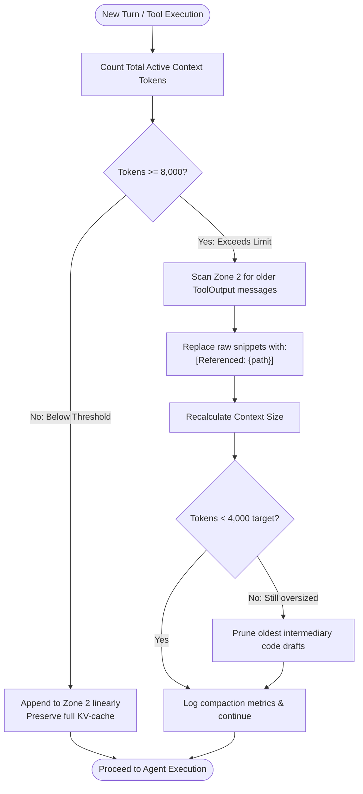
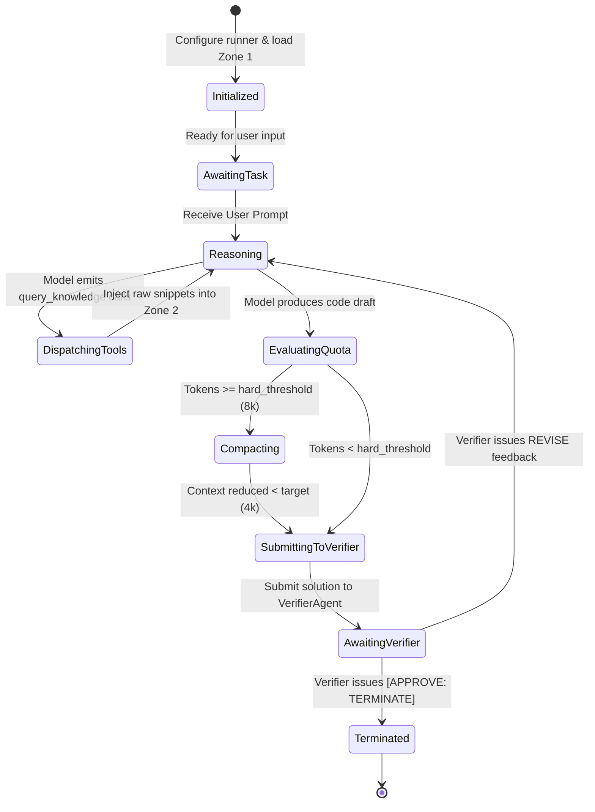

# LibHippo: TaskSolverAgent Runner & Context Harness Specification
## Runtime Architecture & Execution Harness

> **Target Component**: `libhippo.runner.TaskSolverRunner`  
> **Target Agent**: `TaskSolverAgent` (`gpt-4o`)  
> **Core Architectural Reference**: [architecture.md](architecture.md)  
> **Rationale & Benchmarks**: [design_rationale_and_qa.md](design_rationale_and_qa.md)  

---

## 1. Problem Definition & Scope

`TaskSolverAgent` is the central reasoning and code generation agent in LibHippo. During complex programming workflows, it repeatedly calls `query_knowledge`, inspects technical documentation, generates code candidates, and revises drafts based on `VerifierAgent` feedback.

Without an explicit execution harness, conventional agent loops suffer from:
1. **Cache Invalidation from Sliding Windows**: Truncating or summarizing conversational history mid-session breaks static prefix alignment, destroying KV-cache reuse on modern providers (OpenAI, Anthropic, Gemini) and increasing latency/cost by $3\times \sim 5\times$.
2. **Context Window Saturation**: Accumulating multiple raw markdown leaf documents retrieved via `query_knowledge` rapidly exhausts the token quota and causes "Lost in the Middle" hallucinations.
3. **Pronoun Ambiguity in Tool Calls**: Unstructured agent turns produce ambiguous tool queries (e.g., *"fetch rules for that"*), breaking downstream zero-context subagents like `BookKeeperAgent`.

`TaskSolverRunner` serves as the runtime harness enclosing `TaskSolverAgent`, managing prefix-cached memory zones, lazy snippet eviction, tool query disambiguation, and verifier iteration loops.

---

## 2. 3-Zone Context Memory Architecture

The harness divides the prompt context into three strictly regulated zones:

```text
[Prompt-Cache Maximized 3-Zone Architecture]
┌────────────────────────────────────────────────────────────────────────┐
│ Zone 1: Immutable Prefix (100% Cache Read)                             │
│  - System Instructions + Platform/Repo Profiles + Catalog Spec        │
│  👉 Bitwise identical across turns -> 50~80% cost & latency reduction  │
├────────────────────────────────────────────────────────────────────────┤
│ Zone 2: Append-Only Linear History (KV-Cache Extension Zone)           │
│  - User prompt + Agent reasoning trace (CoT)                           │
│  - query_knowledge tool calls & retrieved raw markdown snippets        │
│  👉 Sequential append preserves previous turn KV-cache                 │
├────────────────────────────────────────────────────────────────────────┤
│ Zone 3: Lazy Compaction (Triggered on token quota crossing)            │
│  - Trigger: Cumulative tokens exceed threshold (e.g., 8,000 tokens)    │
│  - Action: Evicts bulky past tool outputs; replaces raw snippets with  │
│    concise markers: '[Referenced: common/.../syntax.md]'               │
└────────────────────────────────────────────────────────────────────────┘
```

### 2.1 Zone 1: Immutable Prefix
- **Contents**: Base system instructions, project-level coding guidelines, active knowledge catalog index spec, and tool definitions.
- **Guarantee**: Bitwise identical across every execution turn within a session. No dynamic timestamps or turn-varying session state may be injected into Zone 1.

### 2.2 Zone 2: Append-Only Linear History
- **Contents**: Initial user task prompt, followed by sequential blocks of:
  - Agent thought/reasoning traces.
  - Tool calls (`query_knowledge`).
  - Verbatim raw knowledge snippets returned by tools.
  - Verifier review feedback.
- **Guarantee**: Turns append monotonically. Past turns remain untouched during normal execution, allowing provider KV-caches to extend incrementally without full re-computation.

### 2.3 Zone 3: Lazy Compaction
- **Threshold**: Evaluated after every tool return or agent turn.
  - Soft threshold: $6{,}000$ tokens (warning & telemetry).
  - Hard trigger: $8{,}000$ tokens (initiates lazy eviction).
- **Compaction Target**: Reduces total context back down below $4{,}000$ tokens.

---

## 3. Lazy Compaction Algorithm & Eviction Mechanics

Rather than invoking an expensive LLM summarization call that destroys context fidelity, `TaskSolverRunner` applies **deterministic tool-payload eviction**.

### 3.1 Eviction Rules

| Message / Segment Type | Eviction Policy | Rationale |
| :--- | :--- | :--- |
| **Zone 1 (Prefix)** | **Never Evicted** | Core persona and catalog instructions must remain static. |
| **User Prompts** | **Never Evicted** | Core user requirements and constraints must remain verbatim. |
| **Agent Reasoning (CoT)** | **Preserved** | The thought progression and architectural decisions must persist. |
| **Verifier Feedback** | **Preserved** | Rejection explanations and fix directives are critical for convergence. |
| **Historic Tool Call Arguments** | **Preserved** | Keeps record of what was queried (`query="...", effort="..."`). |
| **Historic Raw Tool Snippets** | **Evicted $\rightarrow$ Replaced** | Replaced with compact reference pointers: `[Referenced: <path>]`. |
| **Active Turn Tool Snippets** | **Preserved** | Current turn knowledge snippets remain verbatim until the turn concludes. |

### 3.2 Eviction Workflow



### 3.3 Reference Pointer Schema

When a tool output is compacted:
```text
[BEFORE COMPACTION - 1,200 tokens]
ToolResult(call_id="call_9821"):
---
title: "Button Accessibility with ARIA"
path: "common/web/html/accessibility/aria_button.md"
... (1,200 tokens of raw rules, examples, and keyboard handlers) ...
---

[AFTER COMPACTION - 18 tokens]
ToolResult(call_id="call_9821"):
[Referenced: common/web/html/accessibility/aria_button.md (relevance: 0.92, status: HIT)]
```

If the agent subsequently needs to re-read specific rules from that document, it can execute `read_knowledge(file_path="common/web/html/accessibility/aria_button.md", section="rules")`.

---

## 4. Tool Execution & Disambiguation Harness

### 4.1 Query Pre-Disambiguation Enforcement
Downstream subagents (`BookKeeperAgent`) operate in a zero-context sandbox without session history. The runner enforces that queries issued by `TaskSolverAgent` are self-contained.

- **Bad (Rejected/Warned)**: `query_knowledge(query="fix that button bug")`
- **Good (Permitted)**: `query_knowledge(query="HTML custom button ARIA role keyboard accessibility", effort="medium")`

### 4.2 Parallel Tool Dispatch
The harness natively batches multiple tool calls emitted in a single turn:
1. Collect all `query_knowledge` calls from the model response.
2. Dispatch async tasks concurrently via `asyncio.gather`.
3. Collect results, format markdown payloads, and append them atomically to Zone 2.

---

## 5. Runner Execution Lifecycle



---

## 6. Python Class Contracts & Runner Interface

```python
from __future__ import annotations

from dataclasses import dataclass, field
from typing import Any, Literal
from pydantic import BaseModel, Field


class RunnerConfig(BaseModel):
    """Configuration parameters for TaskSolverRunner."""

    model: str = "gpt-4o"
    temperature: float = Field(default=0.2, ge=0.0, le=1.0)
    soft_token_watermark: int = 6000
    hard_token_limit: int = 8000
    compaction_target_tokens: int = 4000
    max_turns: int = 16


@dataclass
class ContextMessage:
    """Represents a message within the 3-Zone context structure."""

    role: Literal["system", "user", "assistant", "tool"]
    content: str
    zone: Literal["zone1_prefix", "zone2_linear", "zone3_compacted"]
    tool_call_id: str | None = None
    file_path_reference: str | None = None
    raw_token_count: int = 0
    is_evictable: bool = False


class TaskSolverRunner:
    """Execution harness wrapping TaskSolverAgent with prompt-cache friendly memory."""

    def __init__(self, config: RunnerConfig | None = None) -> None:
        self.config = config or RunnerConfig()
        self.zone1_prefix: list[ContextMessage] = []
        self.zone2_history: list[ContextMessage] = []
        self.total_tokens: int = 0

    def init_prefix(self, system_prompt: str, catalog_summary: str) -> None:
        """Initialize Zone 1 with immutable system specifications."""
        ...

    async def step(self, user_input: str) -> str:
        """Execute one conversational round, handling tool calls and verifier feedback."""
        ...

    async def dispatch_tools(self, tool_calls: list[dict[str, Any]]) -> list[dict[str, Any]]:
        """Execute query_knowledge calls in parallel and append results to history."""
        ...

    def compact_context(self) -> int:
        """Execute lazy compaction on historical tool snippets when quota is crossed.
        
        Returns the number of tokens reclaimed.
        """
        ...

    def get_prompt_payload(self) -> list[dict[str, str]]:
        """Construct the prompt payload ensuring static prefix alignment."""
        ...

    async def post_task_maintenance(self) -> None:
        """Execute asynchronous background maintenance (e.g. vector store rebuild) after task finishes."""
        ...
```

